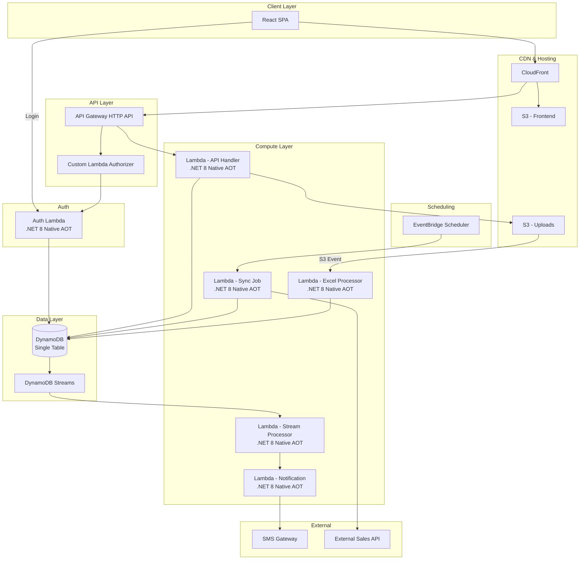

# Design Document: Vision Emporium Loyalty System MVP

## Overview

The Vision Emporium Loyalty System MVP is a serverless customer loyalty and rewards platform deployed on AWS in ap-south-1. It tracks customer purchases across outlets, determines gift eligibility based on configurable thresholds within loyalty cycles, and manages SMS-verified gift redemption at designated outlets.

The system follows a serverless-first architecture using:
- **Compute**: AWS Lambda with .NET 8 Minimal API and Native AOT compilation for sub-200ms cold starts
- **Data**: DynamoDB single-table design with on-demand capacity
- **Auth**: Custom Auth_Lambda with DynamoDB user store, issuing signed JWTs with HMAC-SHA256
- **Frontend**: React SPA on S3/CloudFront
- **Notifications**: Third-party SMS gateway integration

Key design decisions:
1. **Single-table DynamoDB** — Reduces operational overhead and enables efficient access patterns through composite keys and GSIs
2. **Native AOT** — Eliminates JIT compilation overhead, achieving 50-70% cold start reduction critical for user-facing API latency
3. **Asynchronous Excel processing** — Large file imports are uploaded to S3 and processed via background Lambda to avoid API Gateway timeout limits
4. **Event-driven eligibility** — DynamoDB Streams trigger eligibility evaluation and SMS notification, decoupling ingestion from notification logic

## Architecture



### Request Flow

1. **Authentication**: User submits credentials via Auth_Login_Page → Auth_Lambda validates against DynamoDB user store → issues signed JWT (HMAC-SHA256) containing userId, role, outletId (for Outlet_Manager), issued-at, and expiry (default 8 hours)
2. **API Request**: React SPA sends request with JWT Bearer token to CloudFront → routes to API Gateway → Custom Lambda Authorizer validates token signature and expiry
3. **Authorization**: Lambda handler extracts role and outletId from JWT claims, applies policy-based authorization
4. **Data Access**: Handler interacts with DynamoDB using the AWS SDK for .NET

### Data Ingestion Flows

**API Sync Flow:**
1. EventBridge Scheduler triggers Sync Lambda at configured interval
2. Lambda fetches from external API with retry/backoff
3. Validates and deduplicates records
4. Writes to DynamoDB, logs sync results

**Excel Import Flow:**
1. Admin uploads file → API Lambda validates format/size → uploads to S3
2. S3 event triggers Excel Processor Lambda
3. Processor parses, validates, deduplicates rows
4. Writes valid records to DynamoDB, generates import summary

### Eligibility & Notification Flow

1. Purchase record written to DynamoDB
2. DynamoDB Stream triggers Stream Processor Lambda
3. Stream Processor evaluates customer's purchase count against thresholds
4. If threshold reached → writes eligibility record + triggers Notification Lambda
5. Notification Lambda generates verification code, sends SMS via gateway

## Components and Interfaces

### 1. API Handler Lambda

**Responsibility**: Serves all REST API endpoints for the frontend.

**Endpoints** (prefix: `/api/v1/`):

| Method | Path | Role | Description |
|--------|------|------|-------------|
| POST | /auth/login | Public | Authenticate user and issue JWT |
| GET | /customers/{phone} | Admin, Outlet_Manager | Get customer profile |
| GET | /customers/{phone}/codes | Admin, Outlet_Manager | Get customer verification codes |
| POST | /redemptions/verify | Outlet_Manager | Verify and redeem a code |
| GET | /redemptions/search | Outlet_Manager | Search by phone or code |
| GET | /config/cycle | Admin | Get current loyalty cycle |
| PUT | /config/cycle | Admin | Update loyalty cycle |
| GET | /config/thresholds | Admin | Get purchase thresholds |
| PUT | /config/thresholds | Admin | Update thresholds |
| GET | /config/general | Admin | Get general config |
| PUT | /config/general | Admin | Update general config |
| POST | /ingestion/upload | Admin | Upload Excel file |
| GET | /ingestion/jobs/{id} | Admin | Get import job status |
| POST | /ingestion/sync | Admin | Trigger manual sync |
| GET | /ingestion/sync/status | Admin | Get sync job history |
| GET | /outlets | Admin | List outlets |
| POST | /outlets | Admin | Create outlet |
| PUT | /outlets/{id} | Admin | Update outlet |
| PATCH | /outlets/{id}/status | Admin | Activate/deactivate outlet |
| GET | /users | Admin | List users |
| POST | /users | Admin | Create user |
| PUT | /users/{id} | Admin | Update user |
| GET | /dashboard | Admin | Get dashboard summary |
| GET | /audit | Admin | Query audit log |

### 2. Sync Job Lambda

**Responsibility**: Fetches sales data from external API on schedule.

**Interface**:
- **Trigger**: EventBridge Scheduler (configurable interval, min 15 min)
- **Input**: Configuration from DynamoDB (API endpoint, credentials, last sync cursor)
- **Output**: Sync job record in DynamoDB with status and counts

### 3. Excel Processor Lambda

**Responsibility**: Processes uploaded Excel files asynchronously.

**Interface**:
- **Trigger**: S3 PutObject event on uploads bucket
- **Input**: Excel file from S3
- **Output**: Import job record in DynamoDB with status, counts, and rejected row details

### 4. Stream Processor Lambda

**Responsibility**: Evaluates eligibility when purchase records are inserted.

**Interface**:
- **Trigger**: DynamoDB Streams (INSERT events on purchase records)
- **Input**: New purchase record from stream
- **Output**: Eligibility record + notification trigger if threshold met

### 5. Notification Lambda

**Responsibility**: Sends SMS notifications via third-party gateway.

**Interface**:
- **Trigger**: Invoked by Stream Processor or EventBridge (for reminders)
- **Input**: Customer phone, message template, verification code
- **Output**: Notification log record with delivery status

### 6. Auth Lambda

**Responsibility**: Authenticates users against DynamoDB-stored credentials and issues signed JWT tokens.

**Interface**:
- **Trigger**: API Gateway POST /api/v1/auth/login (public endpoint, no authorizer)
- **Input**: JSON body with `email` and `password` fields
- **Output**: JSON response with signed JWT token on success, or HTTP 401 on failure

**Authentication Flow**:
1. Receive login request with email and password
2. Look up user record in DynamoDB by email (GSI1: `GSI1_USER` / `USER#{email}`)
3. Verify password against stored bcrypt hash (cost factor 12)
4. On success: generate JWT with claims (userId, role, outletId if Outlet_Manager, iat, exp)
5. Sign JWT using HMAC-SHA256 with secret from AWS Secrets Manager (or environment variable)
6. Return signed token with 8-hour default expiry

**JWT Token Structure**:
```json
{
  "sub": "{userId}",
  "role": "Admin | Outlet_Manager",
  "outletId": "{outletId}",  // present only for Outlet_Manager
  "iat": 1700000000,
  "exp": 1700028800
}
```

**Password Hashing**: bcrypt with minimum cost factor 12

**Signing**: HMAC-SHA256 with secret stored in AWS Secrets Manager (production) or environment variable (development)

### 7. Custom Lambda Authorizer

**Responsibility**: Validates JWT tokens on incoming API requests for API Gateway.

**Interface**:
- **Trigger**: API Gateway request authorizer (token-based)
- **Input**: Authorization header Bearer token
- **Output**: IAM policy document (Allow/Deny) with principal context containing userId, role, outletId

**Validation Steps**:
1. Extract token from `Authorization: Bearer {token}` header
2. Verify HMAC-SHA256 signature using shared secret
3. Check token expiry (`exp` claim vs current time)
4. Extract claims and pass as request context to downstream Lambda

### 8. Frontend (React SPA)

**Responsibility**: Role-based UI for admin and outlet manager operations.

**Key Pages**:
- Auth_Login_Page (custom login form collecting email/password, authenticates via POST /api/v1/auth/login)
- Dashboard (Admin only)
- Customer Lookup
- Redemption Interface
- Configuration (Cycle, Thresholds, General)
- Outlet Management
- User Management
- Import/Sync Status

### 9. Shared Libraries

- **VELoyalty.Core** — Domain models, validation logic, constants
- **VELoyalty.Data** — DynamoDB repository layer, single-table access patterns
- **VELoyalty.Auth** — JWT generation (HMAC-SHA256 signing), JWT validation, token parsing, role extraction, authorization policies, bcrypt password hashing/verification
- **VELoyalty.Notifications** — SMS gateway client abstraction

## Data Models

### DynamoDB Single-Table Design

**Table Name**: `VELoyalty`
**Billing Mode**: On-Demand (PAY_PER_REQUEST)

#### Primary Key Schema

| Attribute | Type | Description |
|-----------|------|-------------|
| PK | String | Partition key |
| SK | String | Sort key |

#### Global Secondary Indexes

| GSI | PK | SK | Projection | Purpose |
|-----|----|----|------------|---------|
| GSI1 | GSI1PK | GSI1SK | ALL | Phone lookups, outlet queries |
| GSI2 | GSI2PK | GSI2SK | ALL | Code lookups, job status queries |

#### Entity Access Patterns

| Entity | PK | SK | GSI1PK | GSI1SK | GSI2PK | GSI2SK |
|--------|----|----|--------|--------|--------|--------|
| Customer | `CUST#{customerId}` | `PROFILE` | `PHONE#{phone}` | `CUST#{customerId}` | — | — |
| Purchase | `CUST#{customerId}` | `PURCH#{date}#{outletId}#{amount}` | `OUTLET#{outletId}` | `PURCH#{date}` | — | — |
| Eligibility | `CUST#{customerId}` | `ELIG#{cycleId}#{tier}` | `OUTLET#{outletId}` | `ELIG#{date}` | `CODE#{code}` | `ELIG#{customerId}` |
| Redemption | `CUST#{customerId}` | `REDM#{code}` | `OUTLET#{outletId}` | `REDM#{date}` | `CODE#{code}` | `REDM#{date}` |
| Outlet | `OUTLET#{outletId}` | `META` | `GSI1_OUTLET` | `OUTLET#{outletId}` | — | — |
| Config | `CONFIG` | `{configType}#{id}` | — | — | — | — |
| Cycle | `CONFIG` | `CYCLE#{cycleId}` | — | — | — | — |
| Threshold | `CONFIG` | `THRESH#{tier}` | — | — | — | — |
| SyncJob | `SYNC` | `JOB#{timestamp}` | — | — | `JOBID#{jobId}` | `SYNC#{status}` |
| ImportJob | `IMPORT` | `JOB#{timestamp}` | — | — | `JOBID#{jobId}` | `IMPORT#{status}` |
| Notification | `NOTIF#{customerId}` | `{timestamp}#{type}` | — | — | — | — |
| Audit | `AUDIT` | `{timestamp}#{eventType}` | — | — | — | — |
| User | `USER#{userId}` | `META` | `GSI1_USER` | `USER#{email}` | — | — |

#### User Entity Attributes

| Attribute | Type | Description |
|-----------|------|-------------|
| userId | String | Unique user identifier |
| email | String | User email (used for login) |
| name | String | Display name |
| passwordHash | String | bcrypt hash (cost factor 12) |
| role | String | `Admin` or `Outlet_Manager` |
| outletId | String? | Assigned outlet (Outlet_Manager only) |
| isActive | Boolean | Whether the user account is active |
| createdAt | DateTime | Account creation timestamp (UTC) |
| updatedAt | DateTime | Last modification timestamp (UTC) |

#### Key Domain Models (.NET Records)

```csharp
public record Customer(
    string CustomerId,
    string Name,
    string PhoneNumber,       // E.164 format
    int QualifyingPurchases,  // Current cycle count
    string CurrentCycleId
);

public record Purchase(
    string CustomerId,
    string OutletId,
    DateOnly PurchaseDate,
    decimal Amount,           // BDT, 2 decimal places
    string ProductCategory,
    DateTime ProcessedAt      // UTC
);

public record LoyaltyCycle(
    string CycleId,
    DateOnly StartDate,
    DateOnly EndDate,
    bool IsActive
);

public record PurchaseThreshold(
    int Tier,
    int RequiredPurchases,
    string GiftType,          // "Cash_Return" | "Gift_Item"
    string GiftDescription,
    decimal GiftValue,        // BDT
    bool IsEnabled,
    decimal MinPurchaseAmount,
    List<string> ExcludedCategories
);

public record VerificationCode(
    string Code,              // 6-digit numeric
    string CustomerId,
    string OutletId,
    int Tier,
    string GiftType,
    string GiftDescription,
    decimal GiftValue,
    DateTime IssuedAt,        // UTC
    DateTime ExpiresAt,       // UTC
    string Status             // "Active" | "Redeemed" | "Expired"
);

public record Redemption(
    string Code,
    string CustomerId,
    string OutletId,
    string StaffMemberId,
    string GiftType,
    DateTime RedeemedAt       // UTC
);

public record Outlet(
    string OutletId,
    string Name,
    string Address,
    string PhoneNumber,
    string AssignedManagerId,
    bool IsActive
);

public record SyncJobResult(
    string JobId,
    string Status,            // "Success" | "Partial" | "Failed"
    int RecordsFetched,
    int RecordsStored,
    int RecordsSkipped,
    int RecordsRejected,
    DateTime StartedAt,
    DateTime CompletedAt
);

public record AuditEntry(
    string EventType,
    string ActorId,
    string EntityType,
    string EntityId,
    Dictionary<string, string> Details,
    DateTime Timestamp        // UTC
);

public record User(
    string UserId,
    string Email,
    string Name,
    string PasswordHash,      // bcrypt, cost factor 12
    string Role,              // "Admin" | "Outlet_Manager"
    string? OutletId,         // Assigned outlet (Outlet_Manager only)
    bool IsActive,
    DateTime CreatedAt,       // UTC
    DateTime UpdatedAt        // UTC
);

public record AuthToken(
    string Token,             // Signed JWT (HMAC-SHA256)
    DateTime ExpiresAt        // UTC
);
```

#### Verification Code Rate Limiting

Failed redemption attempts are tracked using a DynamoDB item:

| PK | SK | Attributes |
|----|----|----|
| `RATELIMIT#{code}` | `WINDOW#{windowStart}` | `attempts: int`, `blockedUntil: DateTime?` |

TTL is set to auto-expire rate limit records after 45 minutes.

## Correctness Properties

*A property is a characteristic or behavior that should hold true across all valid executions of a system — essentially, a formal statement about what the system should do. Properties serve as the bridge between human-readable specifications and machine-verifiable correctness guarantees.*

### Property 1: Transaction Record Validation

*For any* transaction record, the validation function SHALL accept the record if and only if all required fields are present (customer identifier, customer phone number, outlet identifier, purchase date, purchase amount), the purchase amount is numeric and within 0.01–999,999,999.99, and the purchase date is parseable. All other records SHALL be rejected with a specific reason.

**Validates: Requirements 1.2, 1.8**

### Property 2: Deduplication by Composite Key

*For any* set of transaction records, records sharing the same combination of customer identifier, outlet identifier, purchase date, and purchase amount SHALL be identified as duplicates, and only the first occurrence SHALL be stored.

**Validates: Requirements 1.5, 2.8**

### Property 3: Ingestion Summary Accuracy

*For any* batch of ingested records (API or Excel), the reported summary counts (records fetched/processed, records stored/imported, records rejected, records skipped as duplicates) SHALL equal the actual counts of records in each category.

**Validates: Requirements 1.7, 2.4**

### Property 4: Sync Interval Validation

*For any* numeric interval value, the configuration service SHALL accept the value if and only if it is greater than or equal to 15 minutes.

**Validates: Requirements 1.6**

### Property 5: Excel Schema Validation

*For any* uploaded data structure, the schema validator SHALL accept it if and only if it contains all required columns (customer identifier, customer name, customer phone number, outlet identifier, purchase date, purchase amount, product category) with values conforming to their respective type constraints.

**Validates: Requirements 2.1, 2.3**

### Property 6: Loyalty Cycle Date Validation

*For any* pair of start and end dates, the cycle configuration SHALL be accepted if and only if the end date is after the start date and the duration is between 30 and 730 days inclusive.

**Validates: Requirements 3.1, 3.4**

### Property 7: Cycle Reset Zeroes All Counts

*For any* set of customers with non-zero qualifying purchase counts, after a loyalty cycle reset, all customer purchase counts for the new cycle SHALL equal zero.

**Validates: Requirements 3.2**

### Property 8: Cycle Data Archival Preservation

*For any* loyalty cycle data set, after archival the archived records SHALL be equivalent to the pre-reset data, preserving all purchase counts, eligibility records, and redemption history.

**Validates: Requirements 3.3**

### Property 9: Cycle Modification Isolation

*For any* modification to a future loyalty cycle's configuration, all data and configuration of the current active cycle SHALL remain unchanged.

**Validates: Requirements 3.5**

### Property 10: Days Remaining Calculation

*For any* current date within an active loyalty cycle, the days remaining SHALL equal the number of days from the current date to the cycle end date (inclusive).

**Validates: Requirements 3.6**

### Property 11: Threshold Configuration Validation

*For any* set of purchase threshold values, the configuration SHALL be accepted if and only if there are between 1 and 10 thresholds, each value is a positive integer between 1 and 100, and no two thresholds have the same value.

**Validates: Requirements 4.1, 4.9**

### Property 12: Eligibility Determination

*For any* customer with a qualifying purchase count and a set of configured thresholds, the customer SHALL be marked as eligible for a gift tier if and only if their count equals an enabled threshold value and they have not already been marked eligible for that tier in the current cycle.

**Validates: Requirements 4.2, 4.6**

### Property 13: Non-Retroactive Threshold Changes

*For any* existing eligibility record, modifying the threshold configuration SHALL not alter or remove that eligibility record.

**Validates: Requirements 4.4**

### Property 14: Qualifying Purchase Filter

*For any* purchase transaction, it SHALL count toward the purchase threshold if and only if its amount is greater than or equal to the configured minimum purchase amount AND its product category is not in the excluded categories list.

**Validates: Requirements 4.7, 4.8**

### Property 15: Verification Code Outlet Binding

*For any* customer who becomes eligible, the generated verification code SHALL be bound to the outlet of their most recent qualifying purchase.

**Validates: Requirements 5.2**

### Property 16: Redemption Validation

*For any* redemption attempt with a verification code, the attempt SHALL succeed if and only if: the code exists, conforms to 6-digit numeric format, is not expired, has not been previously redeemed, is presented at the designated outlet, and is not currently rate-limited.

**Validates: Requirements 5.3, 5.4, 5.5, 5.8, 5.10**

### Property 17: One-Time Redemption (Idempotence)

*For any* verification code that has been successfully redeemed, all subsequent redemption attempts for that same code SHALL be rejected regardless of outlet or timing.

**Validates: Requirements 5.6**

### Property 18: Code Expiration Calculation

*For any* verification code with an issuance date and a configured expiry period (7–90 days), the code SHALL be considered expired if and only if the current date exceeds the issuance date plus the configured expiry days.

**Validates: Requirements 5.7**

### Property 19: Rate Limiting Enforcement

*For any* verification code, if more than 5 failed redemption attempts occur within a 15-minute window, all subsequent attempts for that code SHALL be blocked for 30 minutes from the last failed attempt.

**Validates: Requirements 5.11**

### Property 20: Customer Profile Progress Calculation

*For any* customer with a qualifying purchase count and a set of ordered thresholds, the progress display SHALL show the count relative to the next unachieved threshold, or a completion status if all thresholds have been reached.

**Validates: Requirements 6.1, 6.4, 6.5**

### Property 21: Authorization Enforcement

*For any* API endpoint and user role combination, access SHALL be granted if and only if the role has permission for that endpoint according to the role-permission matrix, AND for Outlet_Manager roles, the requested data belongs to their assigned outlet.

**Validates: Requirements 7.2, 7.3, 7.5**

### Property 22: JWT Token Validation

*For any* incoming API request, the Custom Lambda Authorizer SHALL validate the JWT by verifying the HMAC-SHA256 signature and checking that the token is not expired, then extract the user role from the `role` claim and outletId from the `outletId` claim. The system SHALL reject the request with HTTP 401 if the token is missing, malformed, expired, or has an invalid signature.

**Validates: Requirements 7.6, 7.7**

### Property 23: Deactivated Outlet Blocks Redemption

*For any* redemption attempt at a deactivated outlet, the attempt SHALL be rejected regardless of verification code validity.

**Validates: Requirements 8.3**

### Property 24: Last Active Outlet Protection

*For any* set of outlets where exactly one is active, deactivation of that outlet SHALL be rejected.

**Validates: Requirements 8.4**

### Property 25: Audit Record Completeness

*For any* auditable event (redemption, configuration change, or ingestion job), an audit record SHALL be created containing all required fields for that event type, and the record SHALL be immutable (no updates or deletes permitted).

**Validates: Requirements 9.1, 9.2, 9.3, 9.5**

### Property 26: Role-Based Menu Rendering

*For any* authenticated user with a given role, the navigation menu SHALL display exactly the sections permitted for that role (Admin: Dashboard, Customers, Redemptions, Configuration, Outlets, Users; Outlet_Manager: Redemptions, Customers).

**Validates: Requirements 11.3**

### Property 27: Client-Side Form Validation

*For any* form input that violates a field constraint (required field empty, value out of range, invalid format), the validation function SHALL return an error message identifying the specific field and violation before any API submission occurs.

**Validates: Requirements 11.6**

### Property 28: Notification Content Completeness

*For any* eligibility notification event, the composed SMS message SHALL contain the customer name, gift description, designated outlet name, and the 6-digit verification code, and a corresponding notification log record SHALL be created with delivery status, recipient phone, and timestamp.

**Validates: Requirements 12.1, 12.3**

### Property 29: Expiry Reminder Triggering

*For any* active (non-redeemed, non-expired) verification code, a reminder SMS SHALL be triggered if and only if the code is within 7 days of its expiration date and no reminder has already been sent for that code.

**Validates: Requirements 12.2**

### Property 30: Phone Number Validation for Notifications

*For any* customer phone number that does not conform to E.164 format (with Bangladesh +880 default when no country code is supplied), the notification SHALL be logged as undeliverable with the reason, and no SMS delivery SHALL be attempted.

**Validates: Requirements 12.6**

## Error Handling

### API Layer Errors

| Scenario | HTTP Status | Response Body |
|----------|-------------|---------------|
| Missing/invalid JWT | 401 | `{ "error": "Unauthorized", "message": "..." }` |
| Invalid credentials (login) | 401 | `{ "error": "Unauthorized", "message": "Invalid email or password" }` |
| Insufficient role permissions | 403 | `{ "error": "Forbidden", "message": "..." }` |
| Resource not found | 404 | `{ "error": "NotFound", "message": "..." }` |
| Validation failure | 400 | `{ "error": "ValidationError", "details": [...] }` |
| Rate limited | 429 | `{ "error": "TooManyRequests", "message": "...", "retryAfter": 1800 }` |
| Internal error | 500 | `{ "error": "InternalError", "message": "..." }` |

### Data Ingestion Errors

- **API fetch failures**: Retry with exponential backoff (5s, 10s, 20s). After 3 failures, mark job as failed.
- **Excel processing errors**: Row-level validation; invalid rows are rejected individually. Processing continues for valid rows.
- **DynamoDB write failures**: Retry with SDK built-in retry (3 attempts). On persistent failure, log and continue with next record.

### Notification Errors

- **SMS gateway failures**: Retry up to 3 times with 1-hour intervals. Mark as permanently failed after exhaustion.
- **Invalid phone numbers**: Log as undeliverable immediately, no retry.

### Redemption Errors

- **Rate limiting**: After 5 failed attempts in 15 minutes, block for 30 minutes. Return 429 with retry-after header.
- **Expired codes**: Return clear message with expiration date.
- **Wrong outlet**: Return message with correct outlet name (no security concern as code holder is verified customer).

### General Error Strategy

1. All errors are logged with correlation ID for traceability
2. User-facing error messages are descriptive but do not expose internal implementation details
3. DynamoDB conditional write failures (ConditionalCheckFailedException) are handled as conflict/duplicate scenarios
4. Lambda timeout (30s) is monitored; operations approaching timeout are designed to be idempotent for safe retry

## Testing Strategy

### Property-Based Testing

**Library**: [FsCheck](https://fscheck.github.io/FsCheck/) for .NET (integrates with xUnit)

**Configuration**:
- Minimum 100 iterations per property test
- Each test tagged with: `Feature: vision-emporium-loyalty-mvp, Property {N}: {title}`
- Custom generators for domain types (Valid_Phone_Number, Purchase records, Threshold configs)

**Property tests cover**:
- Transaction validation logic (Properties 1, 5)
- Deduplication logic (Property 2)
- Summary computation (Property 3)
- Configuration validation (Properties 4, 6, 11)
- Cycle calculations (Properties 7, 8, 9, 10)
- Eligibility determination (Properties 12, 14)
- Threshold change isolation (Property 13)
- Redemption validation (Properties 15, 16, 17, 18, 19)
- Profile computation (Property 20)
- Authorization logic (Properties 21, 22)
- Outlet business rules (Properties 23, 24)
- Audit immutability (Property 25)
- UI role rendering (Property 26)
- Form validation (Property 27)
- Notification composition (Properties 28, 29, 30)

### Unit Testing (Example-Based)

**Framework**: xUnit with Moq for mocking

**Coverage areas**:
- API retry logic with specific failure scenarios (Requirements 1.3, 1.4)
- Excel file size/row limit boundary cases (Requirements 2.5, 2.6)
- Threshold enable/disable toggle behavior (Requirement 4.5)
- Customer search not-found scenario (Requirement 6.3)
- User CRUD operations (Requirement 7.4)
- Outlet CRUD operations (Requirement 8.2)
- SMS retry with specific failure sequences (Requirements 12.4, 12.5)
- Role-based landing page redirect (Requirement 11.4)

### Integration Testing

**Scope**: End-to-end flows with LocalStack or DynamoDB Local

- Full API sync flow: fetch → validate → store → summary
- Full Excel import flow: upload → S3 → process → summary
- Eligibility flow: purchase → stream → evaluate → notify
- Redemption flow: verify code → redeem → audit
- Authentication flow: Login via Auth_Lambda → JWT issued → API access with Custom Lambda Authorizer

### Frontend Testing

**Framework**: Vitest + React Testing Library

- Component rendering tests for role-based menus
- Form validation behavior tests
- Loading state and error message display tests
- Responsive layout tests at breakpoints (1024px, 768px)

