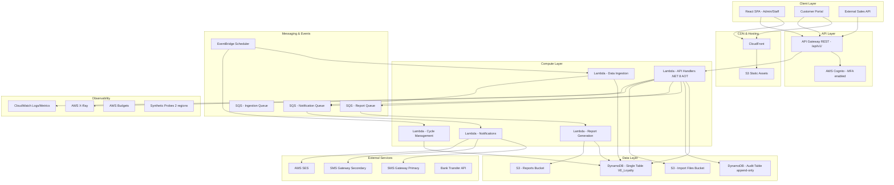
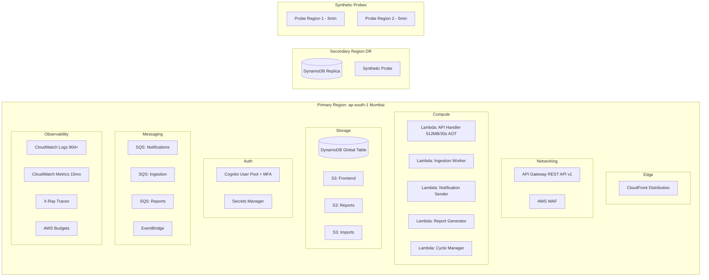
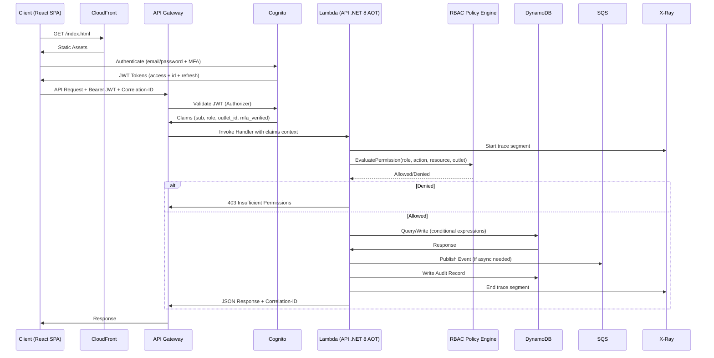
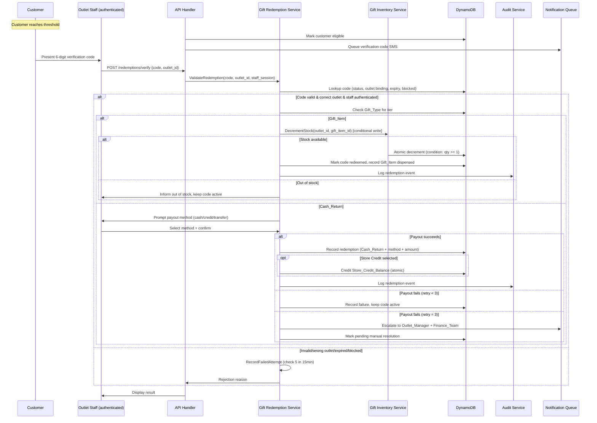
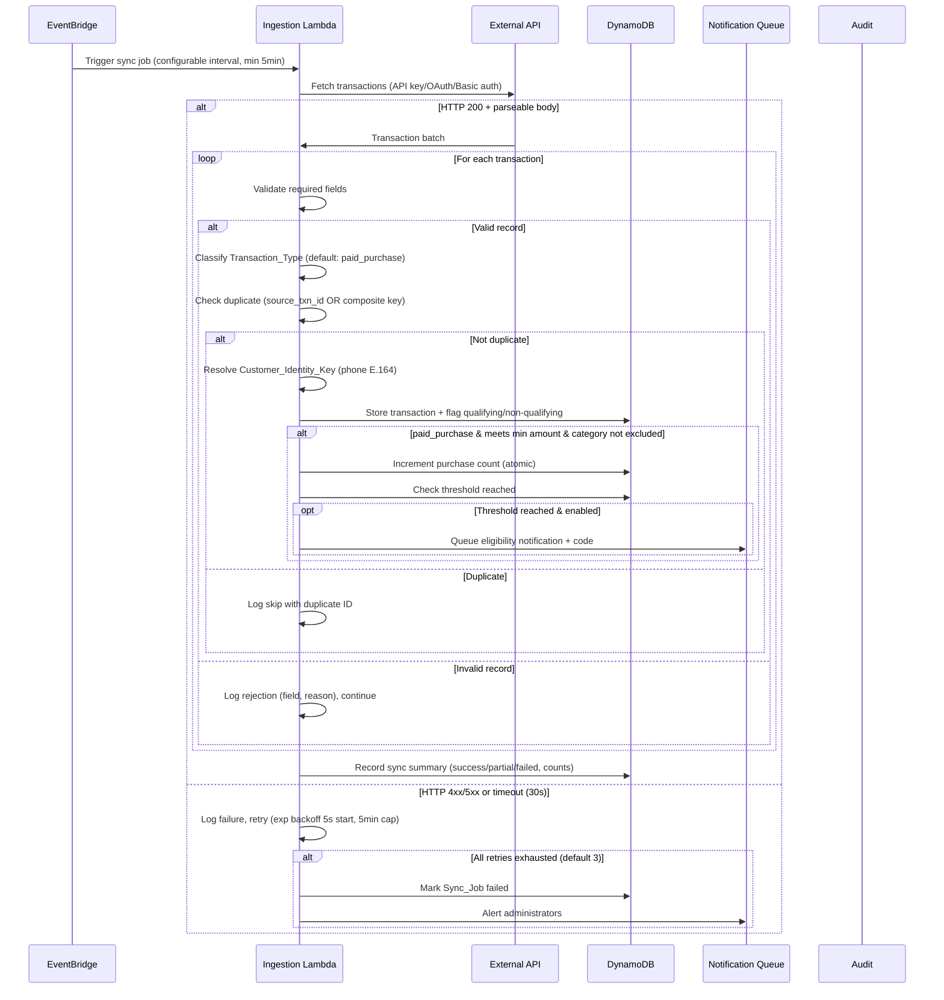
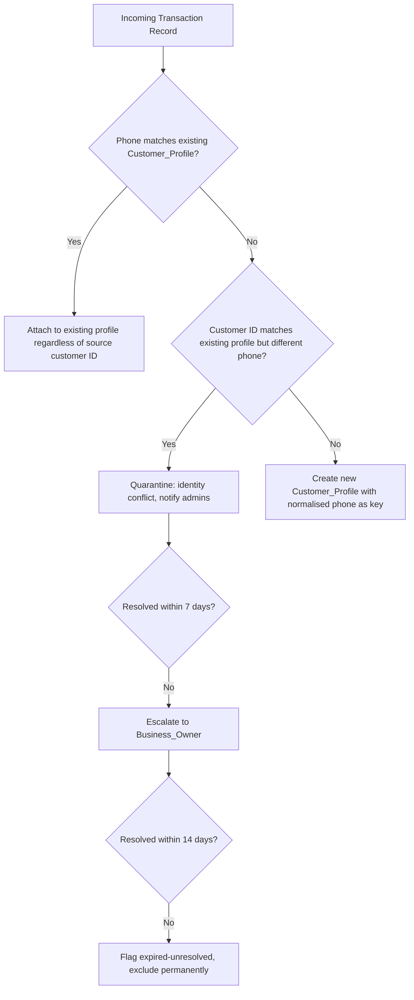
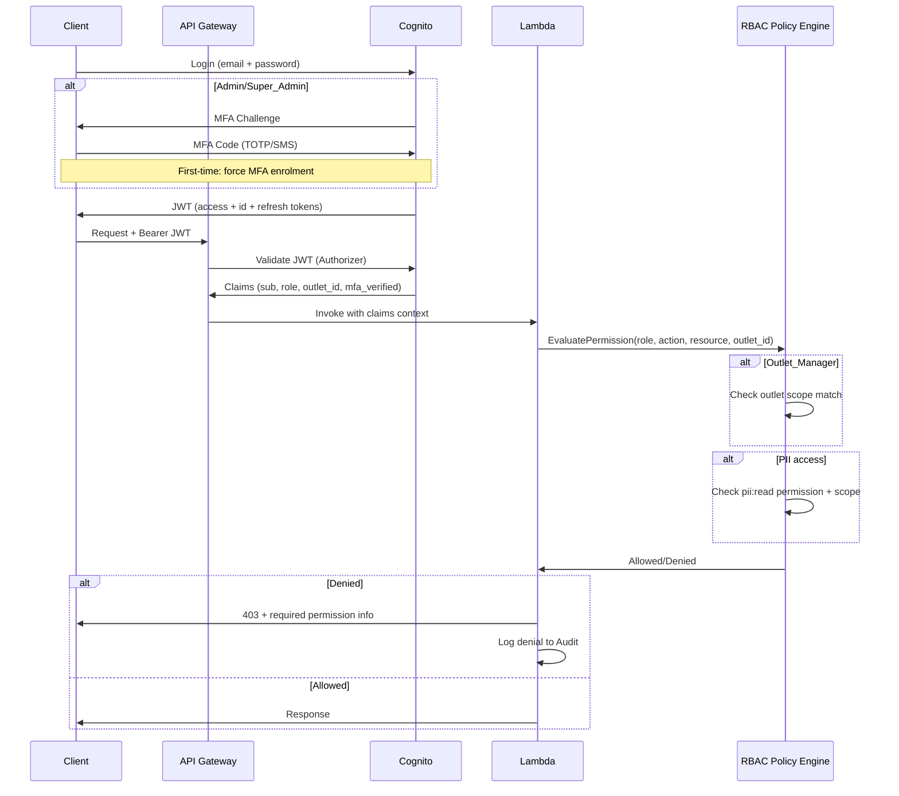
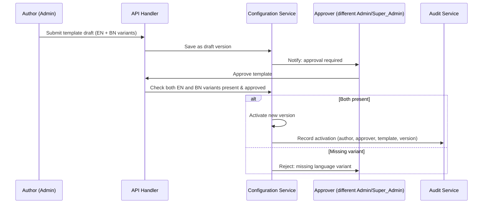
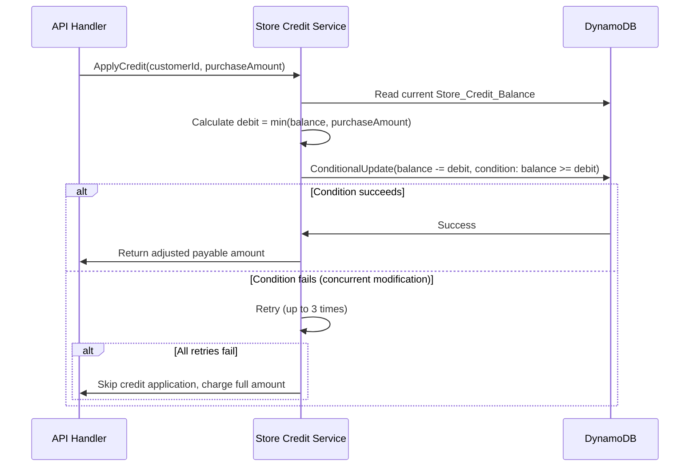

# Design Document: Vision Emporium Loyalty System

## Overview

The Vision Emporium Loyalty System is a serverless, cloud-native customer loyalty and rewards platform deployed on AWS (primary region: `ap-south-1`). It tracks customer purchases across retail outlets, identifies customers reaching configurable purchase thresholds, awards gifts (Cash_Return or Gift_Item), and manages outlet-specific SMS-verified gift redemption. The system supports bilingual operation (English/Bangla), WCAG 2.2 AA accessibility, and comprehensive observability.

### Key Design Decisions

1. **Serverless-First Architecture**: AWS Lambda + API Gateway eliminates idle costs and scales automatically with demand.
2. **DynamoDB Single-Table Design**: Minimizes table costs, achieves single-digit millisecond reads, and supports all access patterns through carefully designed partition/sort key schemas with global tables for DR.
3. **.NET 8 Native AOT on Lambda**: Achieves cold-start times under 2 seconds while maintaining type safety and developer productivity.
4. **Event-Driven Processing**: Asynchronous workflows (notifications, data ingestion, report generation) use SQS/EventBridge to decouple components and enable retry/dead-letter patterns.
5. **React SPA on S3/CloudFront**: Cost-effective static hosting with global CDN distribution.
6. **Cognito + JWT + MFA**: Managed authentication with RBAC enforcement at the API layer; MFA required for Admin/Super_Admin roles.
7. **Dual SMS Gateway with Failover**: Primary + secondary SMS providers with automatic failover after 5 consecutive failures within 10 minutes.
8. **Atomic Conditional Writes**: DynamoDB conditional expressions for inventory decrement and store credit debit to prevent race conditions.
9. **Customer_Identity_Key Resolution**: Valid_Phone_Number (E.164) as the single natural key for cross-source customer identity resolution.
10. **Customer_Portal with OTP Auth**: Self-service portal for customers to view profile, store credit, and submit data requests via one-time SMS code.

### System Boundaries

- **Internal**: API Layer, React Frontend, Customer Portal, Data Ingestion, Loyalty Engine, Gift Redemption, Notifications, Analytics/Dashboard, Audit, Report Generation, Cycle Management, Gift Catalog, Gift Inventory, Outlet Management, RBAC/Policy Engine
- **External**: Third-party SMS Gateway (primary + secondary), External Sales API, AWS SES, Customer browsers/devices, Bank transfer systems

## Architecture

### High-Level System Architecture



### Deployment Architecture



### Request Flow



### Gift Redemption Flow (Gift_Item and Cash_Return)



### Data Ingestion Flow



### Customer Identity Resolution Flow



## Components and Interfaces

### Component Overview

| Component | Responsibility | Lambda Function | Trigger |
|-----------|---------------|-----------------|---------|
| API Handler | REST API endpoints, RBAC enforcement, audit writes | `VE-Loyalty-API` | API Gateway |
| Data Ingestion Worker | External API sync, Excel import processing, identity resolution | `VE-Loyalty-Ingestion` | EventBridge, S3 Event |
| Notification Sender | SMS/Email dispatch, quiet hours, gateway failover, template rendering | `VE-Loyalty-Notifications` | SQS |
| Report Generator | PDF/Excel report creation, scheduled delivery | `VE-Loyalty-Reports` | SQS |
| Cycle Manager | Loyalty cycle reset, archival, retention enforcement, store credit expiry | `VE-Loyalty-CycleManager` | EventBridge (scheduled) |

### Component Interfaces

#### 1. API Handler (VE-Loyalty-API)

**Responsibilities:**
- Serve all REST API endpoints (versioned /api/v1/)
- Enforce JWT authentication via Cognito (MFA for Admin/Super_Admin)
- Enforce RBAC policies per request (outlet-scoped for Outlet_Manager)
- Validate and sanitise request payloads (OWASP API Security Top 10)
- Write audit records for all mutations
- Publish events to SQS for async processing
- Emit structured JSON logs with correlation ID
- Enforce per-user rate limiting (100 req/min default)
- Enforce per-IP rate limiting on verification-code submissions (30/min)
- Serve Customer Portal OTP authentication flow

**Internal Interfaces:**
- `ILoyaltyEngine` - Purchase threshold evaluation, eligibility determination
- `IGiftRedemptionService` - Verification code validation, redemption processing, payout handling
- `ICustomerService` - Customer profile CRUD, identity resolution, merge workflow
- `IConfigurationService` - System configuration management, template versioning
- `IOutletService` - Outlet registry management, deactivation/reassignment
- `IGiftInventoryService` - Stock management operations (Gift_Item only)
- `IGiftCatalogService` - Gift catalog CRUD, archival rules
- `IAuditService` - Append-only audit record creation
- `IRbacService` - Permission evaluation, MFA enforcement, policy management
- `IExchangeService` - Exchange validation and recording
- `IStoreCreditService` - Balance management, atomic debit, expiry
- `IPrivacyService` - Data erasure, anonymisation, export, consent management

#### 2. Data Ingestion Worker (VE-Loyalty-Ingestion)

**Responsibilities:**
- Fetch data from external API on configurable schedule (min 5min interval)
- Process uploaded Excel files from S3 (async job pattern, up to 500K rows in 5min)
- Validate and transform transaction records against schema
- Detect and skip duplicates (source txn ID or composite key)
- Classify transaction types (default to paid_purchase if missing)
- Resolve Customer_Identity_Key (phone E.164 normalisation)
- Quarantine identity conflicts for admin resolution
- Trigger loyalty evaluation for new qualifying purchases
- Support configurable API auth (API key, OAuth 2.0, Basic)
- Handle late-arriving records (attribute to closed cycle, flag if >7 days late)

**Internal Interfaces:**
- `IExternalApiClient` - HTTP client with configurable auth
- `IExcelParser` - Excel file parsing, schema validation, row-level error reporting
- `ITransactionValidator` - Record validation logic (required fields, ranges, formats)
- `IDuplicateDetector` - Duplicate detection using source ID or composite key
- `ITransactionClassifier` - Transaction_Type classification with default/reject logic
- `ICustomerIdentityResolver` - Phone-based identity resolution, conflict detection
- `IIngestionLogger` - Sync job status and metrics recording

#### 3. Notification Sender (VE-Loyalty-Notifications)

**Responsibilities:**
- Process notification queue messages
- Enforce quiet hours (default 22:00-08:00 in Customer_Quiet_Hours_Zone)
- Queue notifications during quiet hours, deliver within 5min after end
- Send SMS via primary gateway, failover to secondary after 5 consecutive failures in 10min
- Send emails via AWS SES
- Handle retries (3 attempts, 1-hour intervals)
- Render bilingual templates (English/Bangla) based on customer preference
- Log delivery status (sent, delivered, failed) with 1-year retention
- Flag undeliverable notifications (invalid phone) for admin review

**Internal Interfaces:**
- `ISmsGateway` - SMS delivery abstraction (primary + secondary)
- `ISmsFailoverPolicy` - Failover detection and transition logic
- `IEmailService` - SES email sending
- `INotificationTemplateEngine` - Bilingual template rendering with variable substitution
- `IQuietHoursPolicy` - Quiet hours evaluation per customer timezone
- `INotificationLogger` - Delivery status logging

#### 4. Report Generator (VE-Loyalty-Reports)

**Responsibilities:**
- Generate PDF and Excel reports (5 types: Customer Summary, Outlet Performance, Redemption Status, Cycle Comparison, Gift Inventory)
- Handle async generation for datasets >100K records
- Store reports in S3 with configurable retention (default 90 days)
- Support scheduled recurring generation (daily/weekly/monthly) with email delivery
- Notify users on completion or failure

**Internal Interfaces:**
- `IReportBuilder` - Report data aggregation with filters
- `IPdfRenderer` - PDF generation
- `IExcelRenderer` - Excel generation
- `IReportStorage` - S3 storage with retention management
- `IReportScheduler` - Recurring schedule management

#### 5. Cycle Manager (VE-Loyalty-CycleManager)

**Responsibilities:**
- Monitor loyalty cycle end dates (23:59:59 System_Time_Zone)
- Reset all customer purchase counts at cycle end
- Archive previous cycle data with configurable retention (1-10 years, default 3)
- Handle late-arriving records (attribute to closed cycle)
- Send 30-day warning notifications to administrators
- Enforce Store_Credit_Balance expiry (24 months inactivity)
- Enforce PII retention and auto-anonymisation
- Clean up expired reports, verification codes, and backups

**Internal Interfaces:**
- `ICycleEvaluator` - Cycle status determination, boundary calculation
- `IArchivalService` - Data archival with retention enforcement
- `IRetentionPolicy` - Multi-entity retention enforcement
- `IStoreCreditExpiryService` - Inactivity-based balance write-off

### Cross-Cutting Concerns

#### Authentication & Authorization Flow



#### Notification Template Versioning Flow



#### Store Credit Debit Flow (Atomic)



### API Design

#### Base URL: `/api/v1`

#### Authentication Endpoints

| Method | Path | Description | Auth Required |
|--------|------|-------------|---------------|
| POST | `/auth/login` | Initiate login | No |
| POST | `/auth/mfa` | Submit MFA code | Partial |
| POST | `/auth/mfa/enrol` | Enrol MFA factor (first-time Admin/Super_Admin) | Partial |
| POST | `/auth/refresh` | Refresh JWT token | Yes |
| POST | `/auth/logout` | Invalidate session | Yes |
| POST | `/auth/recovery-codes` | Generate backup recovery codes | Yes (MFA users) |
| POST | `/auth/mfa/reset` | Reset MFA factor (1 per 24h) | Yes (Super_Admin) |

#### Customer Portal Endpoints

| Method | Path | Description | Auth Required |
|--------|------|-------------|---------------|
| POST | `/portal/otp/request` | Request OTP to customer phone | No (rate-limited) |
| POST | `/portal/otp/verify` | Verify OTP, get session | No (rate-limited) |
| GET | `/portal/profile` | View customer profile | Portal session |
| GET | `/portal/credit-balance` | View store credit balance | Portal session |
| GET | `/portal/codes` | View active verification codes | Portal session |
| POST | `/portal/data-export` | Request personal data export | Portal session |
| POST | `/portal/data-erasure` | Request data erasure | Portal session |
| PUT | `/portal/language` | Set language preference | Portal session |
| POST | `/portal/phone-change` | Initiate phone number change | Portal session |

#### Customer Endpoints

| Method | Path | Description | Roles |
|--------|------|-------------|-------|
| GET | `/customers?phone={phone}` | Search customer by phone | All authenticated |
| GET | `/customers/{id}` | Get customer profile | All authenticated |
| GET | `/customers/{id}/transactions` | Get purchase history (paginated) | All authenticated |
| GET | `/customers/{id}/exchanges` | Get exchange history (paginated) | All authenticated |
| GET | `/customers/{id}/progress` | Get loyalty progress | All authenticated |
| GET | `/customers/{id}/codes` | Get verification codes | Outlet_Manager+ |
| POST | `/customers/merge` | Merge two customer profiles | Admin+ |
| GET | `/customers/quarantine` | List quarantined identity conflicts | Admin+ |
| POST | `/customers/quarantine/{id}/resolve` | Resolve identity conflict | Admin+ |
| POST | `/customers/{id}/consent` | Record/update consent | Admin+ |
| POST | `/customers/{id}/anonymise` | Approve data erasure | Admin+ |
| POST | `/customers/{id}/phone-change` | Change Customer_Identity_Key | Admin+ |

#### Redemption Endpoints

| Method | Path | Description | Roles |
|--------|------|-------------|-------|
| POST | `/redemptions/verify` | Verify and redeem code | Outlet_Manager |
| POST | `/redemptions/{id}/payout` | Process Cash_Return payout | Outlet_Manager |
| POST | `/redemptions/{id}/payout/retry` | Retry failed payout | Outlet_Manager |
| GET | `/redemptions/search?code={code}` | Search by code | Outlet_Manager |
| GET | `/redemptions/search?phone={phone}` | Search by phone | Outlet_Manager |
| POST | `/redemptions/codes/{code}/reissue` | Re-issue verification code | Admin+ |

#### Transaction Endpoints

| Method | Path | Description | Roles |
|--------|------|-------------|-------|
| POST | `/transactions/exchange` | Record exchange | Outlet_Manager |
| POST | `/transactions/return-request` | Submit return (always rejected) | All authenticated |

#### Configuration Endpoints

| Method | Path | Description | Roles |
|--------|------|-------------|-------|
| GET | `/config/cycles` | List loyalty cycles | Admin+ |
| POST | `/config/cycles` | Create cycle | Admin+ |
| PUT | `/config/cycles/{id}` | Update cycle | Admin+ |
| GET | `/config/thresholds` | List thresholds | Admin+ |
| POST | `/config/thresholds` | Create threshold | Admin+ |
| PUT | `/config/thresholds/{id}` | Update threshold | Admin+ |
| PATCH | `/config/thresholds/{id}/toggle` | Enable/disable threshold | Admin+ |
| GET | `/config/sync` | Get sync configuration | Admin+ |
| PUT | `/config/sync` | Update sync schedule | Admin+ |
| GET | `/config/notifications/templates` | List notification templates | Admin+ |
| POST | `/config/notifications/templates` | Submit template draft | Admin+ |
| POST | `/config/notifications/templates/{id}/approve` | Approve template | Admin+ (different user) |
| POST | `/config/notifications/templates/{id}/rollback` | Rollback to previous version | Admin+ |
| GET | `/config/org-roles` | Get organisational role mappings | Super_Admin |
| PUT | `/config/org-roles` | Update organisational role mappings | Super_Admin |

#### Gift Catalog Endpoints

| Method | Path | Description | Roles |
|--------|------|-------------|-------|
| GET | `/catalog/items` | List gift catalog items | Admin+ |
| POST | `/catalog/items` | Create gift catalog item | Admin+ |
| PUT | `/catalog/items/{sku}` | Update gift catalog item | Admin+ |
| PATCH | `/catalog/items/{sku}/archive` | Archive gift catalog item | Admin+ |

#### Outlet Endpoints

| Method | Path | Description | Roles |
|--------|------|-------------|-------|
| GET | `/outlets` | List outlets | All authenticated |
| POST | `/outlets` | Create outlet | Admin+ |
| PUT | `/outlets/{id}` | Update outlet | Admin+ |
| PATCH | `/outlets/{id}/status` | Activate/deactivate | Admin+ |
| GET | `/outlets/{id}/inventory` | Get gift inventory | Outlet_Manager+ |
| POST | `/outlets/{id}/inventory/adjust` | Adjust stock | Admin+ |
| POST | `/outlets/inventory/transfer` | Transfer stock | Admin+ |
| PUT | `/outlets/{id}/managers` | Assign managers (max 10) | Admin+ |

#### Data Ingestion Endpoints

| Method | Path | Description | Roles |
|--------|------|-------------|-------|
| POST | `/ingestion/upload` | Upload Excel file (async, returns job ID) | Admin+ |
| GET | `/ingestion/template` | Download Excel template | Admin+ |
| GET | `/ingestion/jobs` | List sync jobs | Admin+ |
| GET | `/ingestion/jobs/{id}` | Get job details + summary | Admin+ |
| GET | `/ingestion/jobs/{id}/rejections` | Download rejection report | Admin+ |
| POST | `/ingestion/jobs/trigger` | Trigger manual sync | Admin+ |

#### Dashboard & Report Endpoints

| Method | Path | Description | Roles |
|--------|------|-------------|-------|
| GET | `/dashboard/summary` | Get counters (auto-refresh 60s) | Analyst+ |
| GET | `/dashboard/trends` | Get purchase/acquisition trends | Analyst+ |
| GET | `/dashboard/outlets` | Get outlet performance | Analyst+ |
| GET | `/dashboard/redemptions` | Get redemption stats | Analyst+ |
| GET | `/dashboard/comparison` | Get cycle comparison | Analyst+ |
| POST | `/reports/generate` | Generate report | Analyst+ |
| GET | `/reports` | List generated reports | Analyst+ |
| GET | `/reports/{id}/download` | Download report | Analyst+ |
| POST | `/reports/schedule` | Create report schedule | Admin+ |

#### User Management Endpoints

| Method | Path | Description | Roles |
|--------|------|-------------|-------|
| GET | `/users` | List users | Super_Admin |
| POST | `/users` | Create user | Super_Admin |
| PUT | `/users/{id}` | Update user | Super_Admin |
| PUT | `/users/{id}/role` | Change role (requires MFA) | Super_Admin |
| DELETE | `/users/{id}` | Deactivate user | Super_Admin |

#### Audit Endpoints

| Method | Path | Description | Roles |
|--------|------|-------------|-------|
| GET | `/audit` | Search audit logs (paginated, max 200/page) | Admin+ |
| POST | `/audit/export` | Export audit CSV (max 1M records) | Admin+ |

#### API Response Formats

##### Success Response (Single Item)
```json
{
  "data": { /* entity */ },
  "meta": {
    "correlationId": "req-abc123",
    "timestamp": "2024-12-01T15:00:00Z"
  }
}
```

##### Success Response (Paginated List)
```json
{
  "data": [ /* entities */ ],
  "pagination": {
    "page": 1,
    "pageSize": 20,
    "totalRecords": 150,
    "totalPages": 8,
    "nextPage": "/api/v1/customers/C001/transactions?page=2&pageSize=20",
    "prevPage": null
  },
  "meta": {
    "correlationId": "req-abc123",
    "timestamp": "2024-12-01T15:00:00Z"
  }
}
```

##### Error Response
```json
{
  "error": {
    "code": "VALIDATION_ERROR",
    "message": "Request validation failed",
    "details": [
      { "field": "purchaseAmount", "reason": "Must be between 0.01 and 999999999.99" },
      { "field": "purchaseDate", "reason": "Cannot be a future date" }
    ],
    "retryable": false
  },
  "meta": {
    "correlationId": "req-abc123",
    "timestamp": "2024-12-01T15:00:00Z"
  }
}
```

## Data Models

### DynamoDB Single-Table Design

The system uses a single-table design with composite primary keys (PK/SK) and Global Secondary Indexes (GSIs) to support all access patterns efficiently. Global tables enabled for DR replication to approved secondary region.

#### Primary Table: `VE_Loyalty` (Global Table, PITR enabled, on-demand capacity)

| Attribute | Type | Description |
|-----------|------|-------------|
| PK | String | Partition Key |
| SK | String | Sort Key |
| GSI1PK | String | GSI1 Partition Key |
| GSI1SK | String | GSI1 Sort Key |
| GSI2PK | String | GSI2 Partition Key |
| GSI2SK | String | GSI2 Sort Key |
| GSI3PK | String | GSI3 Partition Key (identity resolution) |
| GSI3SK | String | GSI3 Sort Key |
| EntityType | String | Entity discriminator |
| Data | Map | Entity-specific attributes (encrypted at rest) |
| TTL | Number | Time-to-live (epoch seconds) |
| CreatedAt | String | ISO 8601 UTC timestamp |
| UpdatedAt | String | ISO 8601 UTC timestamp |
| Version | Number | Optimistic concurrency control |

#### Entity Key Patterns

| Entity | PK | SK | GSI1PK | GSI1SK | GSI2PK | GSI2SK | GSI3PK | GSI3SK |
|--------|----|----|--------|--------|--------|--------|--------|--------|
| Customer | `CUST#{id}` | `PROFILE` | `PHONE#{e164}` | `CUST#{id}` | `OUTLET#{outletId}` | `CUST#{id}` | - | - |
| Transaction | `CUST#{id}` | `TXN#{date}#{txnId}` | `OUTLET#{outletId}` | `TXN#{date}#{txnId}` | `CYCLE#{cycleId}` | `TXN#{date}#{txnId}` | - | - |
| Exchange | `CUST#{id}` | `EXCH#{date}#{exchId}` | `OUTLET#{outletId}` | `EXCH#{date}` | `CYCLE#{cycleId}` | `EXCH#{date}` | - | - |
| CustomerCycleProgress | `CUST#{id}` | `PROGRESS#{cycleId}` | `CYCLE#{cycleId}` | `COUNT#{count}` | - | - | - | - |
| VerificationCode | `CODE#{code}` | `META` | `CUST#{id}` | `CODE#{code}` | `OUTLET#{outletId}` | `CODE#{code}` | `CODESTATE#{state}` | `{expiresAt}` |
| Redemption | `CUST#{id}` | `REDEEM#{ts}` | `OUTLET#{outletId}` | `REDEEM#{ts}` | `CYCLE#{cycleId}` | `REDEEM#{ts}` | - | - |
| LoyaltyCycle | `CYCLE#{id}` | `CONFIG` | `CYCLE#ACTIVE` | `{endDate}` | - | - | - | - |
| Threshold | `CYCLE#{id}` | `THRESH#{value}` | - | - | - | - | - | - |
| Outlet | `OUTLET#{id}` | `PROFILE` | `OUTLET#ACTIVE` | `{name}` | - | - | - | - |
| GiftCatalogItem | `CATALOG#{sku}` | `META` | `CATALOG#STATUS#{status}` | `{sku}` | - | - | - | - |
| GiftInventory | `OUTLET#{id}` | `INV#{sku}` | `CATALOG#{sku}` | `OUTLET#{id}` | - | - | - | - |
| User | `USER#{id}` | `PROFILE` | `ROLE#{role}` | `USER#{id}` | `OUTLET#{outletId}` | `USER#{id}` | - | - |
| SyncJob | `SYNC#{jobId}` | `META` | `SYNC#STATUS` | `{ts}` | - | - | - | - |
| Notification | `NOTIF#{id}` | `META` | `CUST#{id}` | `NOTIF#{ts}` | `NOTIF#STATUS#{status}` | `{ts}` | - | - |
| NotificationTemplate | `TEMPLATE#{id}` | `VER#{version}` | `TEMPLATE#ACTIVE` | `{id}` | - | - | - | - |
| Configuration | `CONFIG#{scope}` | `{paramName}` | - | - | - | - | - | - |
| Report | `REPORT#{id}` | `META` | `USER#{userId}` | `REPORT#{ts}` | `REPORT#TYPE#{type}` | `{ts}` | - | - |
| Quarantine | `QUARANTINE#{id}` | `META` | `QUARANTINE#STATUS#{status}` | `{ts}` | - | - | - | - |
| StoreCreditLedger | `CUST#{id}` | `CREDIT#{ts}#{entryId}` | - | - | - | - | - | - |
| Consent | `CUST#{id}` | `CONSENT` | - | - | - | - | - | - |
| PhoneAlias | `PHONE#{oldE164}` | `ALIAS` | - | - | `CUST#{id}` | `ALIAS#{ts}` | - | - |

#### Audit Table: `VE_Loyalty_Audit` (Append-only, PITR enabled, no delete IAM permissions)

| Attribute | Type | Description |
|-----------|------|-------------|
| PK | String | `AUDIT#{year}#{month}` |
| SK | String | `{timestamp}#{eventId}` |
| GSI1PK | String | `USER#{userId}` |
| GSI1SK | String | `{timestamp}` |
| GSI2PK | String | `RESOURCE#{resourceType}` |
| GSI2SK | String | `{timestamp}` |
| GSI3PK | String | `ACTION#{actionType}` |
| GSI3SK | String | `{timestamp}` |
| EventType | String | Action type (create, update, delete, login, login_fail, logout, role_change, permission_denied, pii_access, mfa_reset, etc.) |
| UserId | String | Actor identifier |
| ResourceType | String | Affected resource type |
| ResourceId | String | Affected resource identifier |
| BeforeState | Map | State before change (for mutations) |
| AfterState | Map | State after change (for mutations) |
| Metadata | Map | Additional context (IP, correlation ID, outlet, etc.) |
| TTL | Number | Retention-based TTL (configurable 1-10 years, default 5) |

#### Key Entity Data Models

##### Customer Entity
```json
{
  "PK": "CUST#C001",
  "SK": "PROFILE",
  "EntityType": "Customer",
  "Data": {
    "customerId": "C001",
    "name": "রহিম উদ্দিন",
    "phone": "+8801712345678",
    "address": "Gulshan, Dhaka",
    "firstPurchaseDate": "2024-06-15",
    "totalLifetimePurchases": 12,
    "storeCreditBalance": 500.00,
    "storeCreditLastActivity": "2024-11-28T16:45:00Z",
    "status": "active",
    "languagePreference": "bn",
    "consentLoyalty": true,
    "consentSmsMarketing": true,
    "consentSource": "in-store",
    "consentTimestamp": "2024-06-15T10:30:00Z",
    "designatedOutletId": "OUT001",
    "lastQualifyingPurchaseOutlet": "OUT001"
  },
  "GSI1PK": "PHONE#+8801712345678",
  "GSI1SK": "CUST#C001",
  "GSI2PK": "OUTLET#OUT001",
  "GSI2SK": "CUST#C001",
  "Version": 5,
  "CreatedAt": "2024-06-15T10:30:00Z",
  "UpdatedAt": "2024-12-01T14:22:00Z"
}
```

##### VerificationCode Entity (with full state lifecycle)
```json
{
  "PK": "CODE#482917",
  "SK": "META",
  "EntityType": "VerificationCode",
  "Data": {
    "code": "482917",
    "customerId": "C001",
    "outletId": "OUT001",
    "thresholdValue": 3,
    "giftType": "Gift_Item",
    "giftDescription": "Wireless Earbuds",
    "giftCatalogSku": "SKU-WE-001",
    "cashReturnAmount": null,
    "state": "active",
    "issuedAt": "2024-11-28T16:45:00Z",
    "expiresAt": "2024-12-28T16:45:00Z",
    "failedAttempts": 0,
    "failedAttemptsWindow": [],
    "blockedUntil": null,
    "reissuanceCount": 0,
    "originalCodeRef": null,
    "redeemedAt": null,
    "redeemedByStaff": null,
    "payoutMethod": null
  },
  "GSI1PK": "CUST#C001",
  "GSI1SK": "CODE#482917",
  "GSI2PK": "OUTLET#OUT001",
  "GSI2SK": "CODE#482917",
  "GSI3PK": "CODESTATE#active",
  "GSI3SK": "2024-12-28T16:45:00Z",
  "TTL": 1735401900,
  "CreatedAt": "2024-11-28T16:45:00Z"
}
```

##### GiftCatalogItem Entity
```json
{
  "PK": "CATALOG#SKU-WE-001",
  "SK": "META",
  "EntityType": "GiftCatalogItem",
  "Data": {
    "sku": "SKU-WE-001",
    "displayName": "Wireless Earbuds",
    "description": "Premium wireless earbuds with noise cancellation",
    "imageRef": "gifts/sku-we-001.jpg",
    "monetaryValue": 2500.00,
    "status": "active"
  },
  "GSI1PK": "CATALOG#STATUS#active",
  "GSI1SK": "SKU-WE-001",
  "CreatedAt": "2024-05-01T00:00:00Z",
  "UpdatedAt": "2024-05-01T00:00:00Z"
}
```

#### Access Patterns

| Access Pattern | Operation | Key Condition |
|---------------|-----------|---------------|
| Get customer profile | GetItem | PK=`CUST#{id}`, SK=`PROFILE` |
| Get customer by phone (identity resolution) | Query GSI1 | GSI1PK=`PHONE#{e164}` |
| Get customer transactions | Query | PK=`CUST#{id}`, SK begins_with `TXN#` |
| Get customer exchanges | Query | PK=`CUST#{id}`, SK begins_with `EXCH#` |
| Get customer cycle progress | GetItem | PK=`CUST#{id}`, SK=`PROGRESS#{cycleId}` |
| Get customer verification codes | Query GSI1 | GSI1PK=`CUST#{id}`, GSI1SK begins_with `CODE#` |
| Get customer store credit ledger | Query | PK=`CUST#{id}`, SK begins_with `CREDIT#` |
| Get customer consent | GetItem | PK=`CUST#{id}`, SK=`CONSENT` |
| Validate verification code | GetItem | PK=`CODE#{code}`, SK=`META` |
| Get active codes by state | Query GSI3 | GSI3PK=`CODESTATE#active` |
| Get outlet transactions | Query GSI1 | GSI1PK=`OUTLET#{id}`, GSI1SK begins_with `TXN#` |
| Get outlet redemptions | Query GSI1 | GSI1PK=`OUTLET#{id}`, GSI1SK begins_with `REDEEM#` |
| Get outlet inventory | Query | PK=`OUTLET#{id}`, SK begins_with `INV#` |
| Get outlet codes | Query GSI2 | GSI2PK=`OUTLET#{id}`, GSI2SK begins_with `CODE#` |
| Get active cycle | Query GSI1 | GSI1PK=`CYCLE#ACTIVE` |
| Get cycle thresholds | Query | PK=`CYCLE#{id}`, SK begins_with `THRESH#` |
| Get customers at threshold count | Query GSI1 | GSI1PK=`CYCLE#{id}`, GSI1SK begins_with `COUNT#` |
| Get gift catalog by status | Query GSI1 | GSI1PK=`CATALOG#STATUS#{status}` |
| Get inventory for catalog item | Query GSI1 | GSI1PK=`CATALOG#{sku}` |
| Get users by role | Query GSI1 | GSI1PK=`ROLE#{role}` |
| Get sync job history | Query GSI1 | GSI1PK=`SYNC#STATUS` |
| Get quarantined records | Query GSI1 | GSI1PK=`QUARANTINE#STATUS#pending` |
| Get audit by user | Query GSI1 (Audit) | GSI1PK=`USER#{id}` |
| Get audit by resource | Query GSI2 (Audit) | GSI2PK=`RESOURCE#{type}` |
| Get audit by action type | Query GSI3 (Audit) | GSI3PK=`ACTION#{type}` |
| Get notification templates (active) | Query GSI1 | GSI1PK=`TEMPLATE#ACTIVE` |
| Get phone alias history | Query GSI2 | GSI2PK=`CUST#{id}`, GSI2SK begins_with `ALIAS#` |

### Core Domain Models (.NET 8)

```csharp
// Domain/Enums
public enum TransactionType { PaidPurchase, GiftRedemption, Exchange }
public enum GiftType { CashReturn, GiftItem }
public enum VerificationCodeState { Issued, Active, Redeemed, Expired, Reassigned, Blocked }
public enum PayoutMethod { CashFromTill, StoreCredit, BankTransfer }
public enum CatalogItemStatus { Active, Archived }

// Domain/Entities/Customer.cs
public sealed record Customer
{
    public required string CustomerId { get; init; }
    public required string Name { get; init; }
    public required string Phone { get; init; } // E.164 normalised
    public string? Address { get; init; }
    public DateTime FirstPurchaseDate { get; init; }
    public int TotalLifetimePurchases { get; init; }
    public decimal StoreCreditBalance { get; init; }
    public DateTime? StoreCreditLastActivity { get; init; }
    public string Status { get; init; } = "active";
    public string LanguagePreference { get; init; } = "en";
    public bool ConsentLoyalty { get; init; }
    public bool ConsentSmsMarketing { get; init; }
    public string? ConsentSource { get; init; }
    public DateTime? ConsentTimestamp { get; init; }
    public string? DesignatedOutletId { get; init; }
}

// Domain/Entities/VerificationCode.cs
public sealed record VerificationCode
{
    public required string Code { get; init; }
    public required string CustomerId { get; init; }
    public required string OutletId { get; init; }
    public required int ThresholdValue { get; init; }
    public required GiftType GiftType { get; init; }
    public required string GiftDescription { get; init; }
    public string? GiftCatalogSku { get; init; }
    public decimal? CashReturnAmount { get; init; }
    public required VerificationCodeState State { get; init; }
    public required DateTime IssuedAt { get; init; }
    public required DateTime ExpiresAt { get; init; }
    public int FailedAttempts { get; init; }
    public DateTime? BlockedUntil { get; init; }
    public int ReissuanceCount { get; init; }
    public string? OriginalCodeRef { get; init; }
}

// Domain/Entities/GiftCatalogItem.cs
public sealed record GiftCatalogItem
{
    public required string Sku { get; init; }
    public required string DisplayName { get; init; }
    public string? Description { get; init; }
    public string? ImageRef { get; init; }
    public required decimal MonetaryValue { get; init; }
    public required CatalogItemStatus Status { get; init; }
}
```

### Key Algorithms

#### Purchase Threshold Evaluation

```csharp
public bool EvaluateQualification(Transaction txn, LoyaltyCycleConfig config)
{
    if (txn.TransactionType != TransactionType.PaidPurchase) return false;
    if (txn.PurchaseAmount < config.MinimumPurchaseAmount) return false;
    if (config.ExcludedCategories.Contains(txn.ProductCategory, StringComparer.OrdinalIgnoreCase))
        return false;
    return true;
}
```

#### Verification Code Validation (Full State Machine)

```csharp
public async Task<RedemptionValidationResult> ValidateRedemption(
    string code, string outletId, string staffSessionOutlet)
{
    if (!Regex.IsMatch(code, @"^\d{6}$"))
        return RedemptionValidationResult.InvalidFormat();

    var vc = await _repository.GetVerificationCode(code);
    if (vc is null) return RedemptionValidationResult.NotFound();
    if (vc.State == VerificationCodeState.Blocked)
        return RedemptionValidationResult.Blocked(vc.BlockedUntil!.Value);
    if (vc.BlockedUntil > DateTime.UtcNow)
        return RedemptionValidationResult.Blocked(vc.BlockedUntil.Value);
    if (vc.State == VerificationCodeState.Expired || vc.ExpiresAt < DateTime.UtcNow)
        return RedemptionValidationResult.Expired(vc.ExpiresAt);
    if (vc.State == VerificationCodeState.Redeemed)
        return RedemptionValidationResult.AlreadyRedeemed();
    if (vc.State == VerificationCodeState.Reassigned)
        return RedemptionValidationResult.Reassigned();
    if (vc.OutletId != outletId)
        return RedemptionValidationResult.WrongOutlet(vc.OutletId);
    if (staffSessionOutlet != outletId)
        return RedemptionValidationResult.StaffOutletMismatch();

    return RedemptionValidationResult.Valid(vc);
}
```

#### Store Credit Atomic Debit

```csharp
public async Task<StoreCreditDebitResult> DebitStoreCredit(
    string customerId, decimal purchaseAmount)
{
    for (int attempt = 0; attempt < 3; attempt++)
    {
        var customer = await _repository.GetCustomer(customerId);
        if (customer.StoreCreditBalance <= 0) return StoreCreditDebitResult.NoCredit();

        var debitAmount = Math.Min(customer.StoreCreditBalance, purchaseAmount);
        var success = await _repository.ConditionalDebitBalance(
            customerId, debitAmount, expectedBalance: customer.StoreCreditBalance);

        if (success)
            return StoreCreditDebitResult.Applied(debitAmount, customer.StoreCreditBalance - debitAmount);
    }
    return StoreCreditDebitResult.SkippedDueToContention();
}
```

#### Customer Identity Resolution

```csharp
public async Task<IdentityResolutionResult> ResolveIdentity(RawTransactionRecord record)
{
    var normalisedPhone = PhoneNormaliser.ToE164(record.CustomerPhone, defaultCountry: "+880");
    var existingByPhone = await _repository.GetCustomerByPhone(normalisedPhone);

    if (existingByPhone is not null)
        return IdentityResolutionResult.Matched(existingByPhone.CustomerId);

    var existingById = await _repository.GetCustomerById(record.CustomerId);
    if (existingById is not null && existingById.Phone != normalisedPhone)
        return IdentityResolutionResult.Conflict(record.CustomerId, normalisedPhone);

    // Create new profile
    var newId = await _repository.CreateCustomer(normalisedPhone, record);
    return IdentityResolutionResult.Created(newId);
}
```

### Lambda Function Structure

```
src/
├── VE.Loyalty.Api/                    # API Handler Lambda (.NET 8 Native AOT)
│   ├── Program.cs                     # Minimal API setup
│   ├── Endpoints/
│   │   ├── CustomerEndpoints.cs
│   │   ├── RedemptionEndpoints.cs
│   │   ├── TransactionEndpoints.cs
│   │   ├── ConfigurationEndpoints.cs
│   │   ├── OutletEndpoints.cs
│   │   ├── CatalogEndpoints.cs
│   │   ├── DashboardEndpoints.cs
│   │   ├── ReportEndpoints.cs
│   │   ├── UserEndpoints.cs
│   │   ├── AuditEndpoints.cs
│   │   ├── IngestionEndpoints.cs
│   │   └── PortalEndpoints.cs
│   ├── Middleware/
│   │   ├── CorrelationIdMiddleware.cs
│   │   ├── RbacMiddleware.cs
│   │   ├── RateLimitMiddleware.cs
│   │   ├── PiiMaskingMiddleware.cs
│   │   └── SessionTimeoutMiddleware.cs
│   └── Filters/
│       └── ValidationFilter.cs
├── VE.Loyalty.Domain/                 # Domain logic (shared layer)
│   ├── Entities/
│   ├── Interfaces/
│   ├── Services/
│   ├── ValueObjects/
│   └── Policies/
├── VE.Loyalty.Infrastructure/         # DynamoDB, SQS, S3 implementations
│   ├── DynamoDb/
│   ├── Messaging/
│   ├── Storage/
│   ├── External/
│   └── Resilience/
├── VE.Loyalty.Ingestion/             # Ingestion Worker Lambda
├── VE.Loyalty.Notifications/         # Notification Sender Lambda
├── VE.Loyalty.Reports/               # Report Generator Lambda
└── VE.Loyalty.CycleManager/          # Cycle Manager Lambda
```

## Correctness Properties

*A property is a characteristic or behavior that should hold true across all valid executions of a system—essentially, a formal statement about what the system should do. Properties serve as the bridge between human-readable specifications and machine-verifiable correctness guarantees.*

### Property 1: Transaction Record Validation

*For any* raw transaction record that is missing one or more required fields (customerId, customerPhone, outletId, purchaseDate, purchaseAmount) or contains invalid data (non-numeric purchaseAmount, purchaseAmount outside 0.01–999,999,999.99, unparseable purchaseDate, future purchaseDate, invalid phone format), the validation function SHALL return a rejection result containing the specific field name and failure reason for each invalid field, and SHALL NOT store the record. This applies identically to records from the external API and Excel import sources.

**Validates: Requirements 1.9, 2.1, 2.3**

### Property 2: Duplicate Detection by Composite Key

*For any* two transaction records sharing the same source transaction identifier (when present) or the same composite key (customerId, outletId, purchaseDate, purchaseAmount, itemId), the second record encountered SHALL be identified as a duplicate and skipped, regardless of whether the source is the external API or an Excel import.

**Validates: Requirements 1.5, 2.8**

### Property 3: Transaction Type Classification

*For any* raw transaction record: if the Transaction_Type field is missing or empty, the system SHALL classify it as paid_purchase; if the field contains exactly one of "paid_purchase", "gift_redemption", or "exchange", the system SHALL accept that classification; if the field contains any other value, the system SHALL reject the record with a reason indicating the invalid type. This rule applies identically across API and Excel sources.

**Validates: Requirements 1.10, 1.11, 2.9, 2.10**

### Property 4: Non-Qualifying Transactions Never Increment Purchase Count

*For any* transaction with Transaction_Type of gift_redemption or exchange, the system SHALL NOT increment the customer's purchase count toward any Purchase_Threshold, regardless of the transaction's purchase amount, product category, or source. Additionally, the value difference paid during an Exchange_Transaction SHALL NOT count as a new purchase.

**Validates: Requirements 1.12, 2.11, 17.5, 17.6, 17.7, 17.14**

### Property 5: Purchase Qualification Criteria

*For any* transaction with Transaction_Type paid_purchase, the transaction SHALL qualify toward Purchase_Threshold progression if and only if: (a) the purchase amount is greater than or equal to the configured minimum purchase amount, AND (b) the product category is NOT in the configured excluded categories list. Transactions failing either condition SHALL NOT increment the customer's purchase count.

**Validates: Requirements 4.7, 4.8**

### Property 6: Threshold Eligibility Determination

*For any* customer whose qualifying purchase count within the current Loyalty_Cycle equals a configured Purchase_Threshold value: if that threshold is enabled, the system SHALL mark the customer as an Eligible_Customer for the corresponding gift tier; if that threshold is disabled, the system SHALL NOT mark the customer as eligible and SHALL NOT trigger any notification for that tier.

**Validates: Requirements 4.2, 4.6**

### Property 7: Loyalty Cycle Reset Zeroes All Progress

*For any* set of customers with non-zero purchase counts in a Loyalty_Cycle, when 23:59:59 System_Time_Zone on the cycle end date is reached and the reset is triggered, ALL customer purchase counts for that cycle SHALL be reset to zero. Store_Credit_Balance SHALL NOT be affected by the reset.

**Validates: Requirements 3.2, 5.18**

### Property 8: Cycle Configuration Validation

*For any* loyalty cycle definition, the Configuration_Service SHALL reject it if: (a) the end date is on or before the start date, (b) the duration is less than 30 days or greater than 730 days, or (c) the dates overlap with an existing cycle. All valid cycle definitions within these constraints SHALL be accepted.

**Validates: Requirements 3.1, 3.4**

### Property 9: Cycle Progress Calculation

*For any* active loyalty cycle with known start date S, end date E, and current date C (where S <= C <= E), the system SHALL calculate days remaining as (E - C) and progress percentage as floor((C - S) / (E - S) * 100), yielding a whole number from 0 to 100.

**Validates: Requirements 3.6**

### Property 10: Duplicate Threshold Rejection

*For any* Purchase_Threshold value that already exists within the same Loyalty_Cycle configuration, attempting to add another threshold with the same value SHALL be rejected with an error indicating the duplicate.

**Validates: Requirements 4.9**

### Property 11: Late-Arriving Records Attributed to Closed Cycle

*For any* transaction record ingested after a Loyalty_Cycle reset whose purchase date falls within the just-closed cycle, the system SHALL attribute the record to the closed cycle for archival reporting and SHALL NOT increment any Purchase_Threshold count in the new cycle. Records with purchase dates older than 7 calendar days before the reset SHALL additionally be flagged for administrator review.

**Validates: Requirements 3.8**

### Property 12: Verification Code Outlet Binding

*For any* customer who becomes eligible, the generated verification code SHALL be bound to the outlet where the customer's most recent qualifying purchase was made. Attempting to redeem the code at any other outlet SHALL be rejected with a message indicating the designated outlet name and address.

**Validates: Requirements 5.2, 5.4**

### Property 13: Verification Code One-Time Use

*For any* verification code that has been successfully redeemed (state = redeemed), all subsequent redemption attempts for that same code SHALL be rejected, regardless of the outlet, staff member, or time of attempt.

**Validates: Requirements 5.5, 5.6**

### Property 14: Verification Code Expiry Enforcement

*For any* verification code where the current time exceeds the code's expiration timestamp (issuedAt + configurable expiry days, range 7-90, default 30), the system SHALL reject redemption attempts and include the original expiration date in the rejection message.

**Validates: Requirements 5.7, 5.8**

### Property 15: Verification Code Format Validation

*For any* string that does not match the pattern of exactly 6 numeric digits (regex `^\d{6}$`), the Gift_Redemption_Service SHALL reject the redemption attempt as an invalid code format without performing any database lookup.

**Validates: Requirements 5.10**

### Property 16: Verification Code Rate Limiting

*For any* verification code that accumulates more than 5 failed redemption attempts within a 15-minute sliding window, the system SHALL block further redemption attempts for that code for 30 minutes from the time of the 5th failure. Attempts outside the 15-minute window SHALL NOT count toward the threshold.

**Validates: Requirements 5.11**

### Property 17: Cash_Return Redemption Does Not Affect Inventory

*For any* successful redemption of a Purchase_Threshold tier with Gift_Type set to Cash_Return, the Gift_Inventory_Service SHALL NOT be invoked and no physical gift stock SHALL be modified at any outlet. No stock display, alerts, or configuration SHALL exist for Cash_Return tiers.

**Validates: Requirements 5.13, 6.5, 6.9**

### Property 18: Inventory Stock Non-Negativity and Bounds Invariant

*For any* sequence of inventory operations (add, transfer, adjust, Gift_Item redemption decrement), the stock quantity for any gift item at any outlet SHALL remain a non-negative integer not exceeding 10,000. Any operation that would result in a value outside [0, 10000] SHALL be rejected. Gift_Item redemption uses an atomic conditional write that succeeds only if current stock >= 1.

**Validates: Requirements 6.1, 6.4, 6.7, 6.8, 5.12**

### Property 19: Inventory Transfer Conservation

*For any* stock transfer of quantity N from source outlet to destination outlet for a given gift item, the total quantity of that item across all outlets SHALL remain constant (source decreases by N, destination increases by N). If the source has fewer than N units, the transfer SHALL be rejected.

**Validates: Requirements 6.3, 6.7**

### Property 20: Store Credit Round Trip

*For any* Cash_Return payout processed with the store credit method, the configured Cash_Return amount SHALL be added to the customer's Store_Credit_Balance. On the customer's next qualifying Paid_Purchase, the system SHALL automatically debit up to the available balance to reduce the payable amount. The sum of all debits against a credit SHALL never exceed the original credit amount.

**Validates: Requirements 5.17, 5.20**

### Property 21: Store Credit Atomic Debit Consistency

*For any* two concurrent purchases attempting to debit the same customer's Store_Credit_Balance, the system SHALL use an atomic conditional write ensuring the total debited across both purchases never exceeds the available balance. On condition failure, the system SHALL retry up to 3 times before skipping credit application and charging the full amount.

**Validates: Requirements 5.20**

### Property 22: Store Credit Persistence and Expiry

*For any* customer's Store_Credit_Balance, the balance SHALL persist across Loyalty_Cycle resets and SHALL NOT be reset when purchase counts are zeroed. The balance SHALL expire (written off to zero) only after 24 months of customer inactivity (no Paid_Purchase, no Exchange_Transaction, no redemption), with the write-off recorded in the Audit_Service.

**Validates: Requirements 5.18**

### Property 23: RBAC Policy Evaluation

*For any* combination of user role, action type, resource type, and outlet context, the RBAC_Service SHALL grant access if and only if the role's policy definition includes that action on that resource type. For Outlet_Manager roles, access SHALL additionally be restricted to resources belonging to the user's assigned outlet. Access denied events SHALL be logged to the Audit_Service.

**Validates: Requirements 10.2, 10.3, 10.8, 10.9**

### Property 24: Minimum Entity Protection

*For any* operation that would remove, downgrade, or deactivate the last remaining: (a) Super_Admin user, (b) user assigned to any organisational accountability role (Business_Owner, Technical_Lead, Finance_Team), or (c) active outlet, the system SHALL reject the operation with an appropriate error message.

**Validates: Requirements 10.5, 10.13, 16.4**

### Property 25: Quiet Hours Notification Queuing

*For any* customer notification generated during quiet hours (default 22:00 to 08:00 in the Customer_Quiet_Hours_Zone), the notification SHALL be queued and NOT delivered until quiet hours end, at which point it SHALL be delivered within 5 minutes in generation order. Notifications generated outside quiet hours SHALL be eligible for immediate delivery.

**Validates: Requirements 12.7**

### Property 26: Notification Suppression for Non-Consenting or Invalid Customers

*For any* customer whose consent flag for SMS marketing is not set or has been withdrawn, the Notification_Service SHALL NOT send marketing or eligibility SMS to that customer. Additionally, for any customer whose phone number is missing or does not conform to Valid_Phone_Number format, the notification SHALL be logged as undeliverable and the profile flagged for review.

**Validates: Requirements 18.2, 12.8**

### Property 27: Notification Template Bilingual Activation

*For any* notification template version activation attempt, the system SHALL reject the activation if either the English or Bangla language variant is missing or unapproved for that template identifier. Both variants must be present and approved before activation succeeds.

**Validates: Requirements 12.11**

### Property 28: API Validation Error Response Format

*For any* API request that fails input validation, the response SHALL contain HTTP status 400 and a structured error body with field-level details (field name and validation failure reason) for each invalid field, plus a correlation ID in the meta object.

**Validates: Requirements 14.3, 14.8**

### Property 29: API Pagination Correctness

*For any* list endpoint with N total records requested with page P and pageSize S (where 1 <= S <= 100), the response SHALL contain exactly min(S, max(0, N - (P-1)*S)) records, totalRecords equal to N, totalPages equal to ceil(N/S), correct current page number, and valid next/previous page links (null when at first/last page boundary). Results SHALL be sorted by the documented sort key in the documented order.

**Validates: Requirements 14.7, 7.4, 7.5**

### Property 30: API Rate Limiting Enforcement

*For any* authenticated user who sends more than the configured rate limit (default: 100) requests within a 1-minute window, all subsequent requests within that window SHALL receive HTTP 429 with a Retry-After header indicating seconds until reset. Additionally, for verification-code submissions, a per-source-IP limit of 30 attempts per minute SHALL apply, with the more restrictive limit taking precedence.

**Validates: Requirements 14.6, 19.7**

### Property 31: Return Request Universal Rejection

*For any* return request submitted through any channel (in-store interface, customer portal, or API), the system SHALL reject the request within 2 seconds and display a message indicating that returns are not permitted under the current store policy. The rejection SHALL be recorded in the Audit_Service.

**Validates: Requirements 17.1, 17.2**

### Property 32: Exchange Validation Rules

*For any* exchange request, the system SHALL reject the operation if any of the following conditions hold: (a) the original purchase reference is invalid or does not belong to the same customer, (b) the exchange is attempted at a different outlet than the original purchase, (c) the original purchase date is more than 30 calendar days before the exchange date, (d) the original purchase belongs to an archived Loyalty_Cycle, (e) the replacement item's monetary value is less than the original item's value, or (f) the original purchase reference is itself a replacement item from a prior Exchange_Transaction. Each rejection SHALL include a specific message indicating the violated rule.

**Validates: Requirements 17.3, 17.4, 17.10, 17.11, 17.12, 17.13, 17.17**

### Property 33: PII Masking by Permission

*For any* API response containing customer phone number or address fields, the system SHALL mask all but the last four digits of the phone number and redact the address for any requesting user whose role does not have the explicit pii:read policy permission. Users with pii:read SHALL see unmasked data only for customers within their permission scope (Outlet_Manager: scoped to assigned outlet's customers).

**Validates: Requirements 18.5**

### Property 34: Customer Identity Resolution by Phone

*For any* incoming transaction record: (a) if the normalised Valid_Phone_Number matches an existing Customer_Profile, the transaction SHALL be attached to that profile regardless of the source-supplied customer identifier; (b) if the phone does not match any profile but the customer identifier matches an existing profile with a different phone, the record SHALL be quarantined as an identity conflict; (c) if neither phone nor ID matches any existing profile, a new Customer_Profile SHALL be created with the normalised phone as the Customer_Identity_Key.

**Validates: Requirements 23.1, 23.2, 23.3, 23.4**

### Property 35: Customer Merge Rejection with Overlapping Active Codes

*For any* administrator attempt to merge two Customer_Profile records that have overlapping active verification codes for the same Purchase_Threshold tier, the system SHALL reject the merge and display a message indicating that conflicting active codes must be resolved first.

**Validates: Requirements 23.6**

### Property 36: Outlet Deactivation Code Reassignment

*For any* outlet being deactivated that has pending (active, unredeemed) verification codes, those codes SHALL be reassigned to the geographically closest active outlet based on stored address coordinates. Each affected customer SHALL receive an SMS notification with the new designated outlet name and address.

**Validates: Requirements 16.3, 16.5**

### Property 37: Threshold Progress Display

*For any* customer with a qualifying purchase count C and a set of configured enabled thresholds sorted ascending, the system SHALL identify the next threshold as the smallest threshold value greater than C and display progress as "C of T purchases". If C >= all configured enabled thresholds, the system SHALL display a completion status indicating all reward tiers have been achieved.

**Validates: Requirements 7.6, 7.7**

### Property 38: Duplicate Gift Catalog SKU Rejection

*For any* attempt to create a Gift_Catalog_Item with a SKU that already exists in the catalog, the system SHALL reject the operation and display a message indicating the duplicate SKU.

**Validates: Requirements 22.3**

### Property 39: Cannot Archive Referenced Catalog Item

*For any* attempt to archive a Gift_Catalog_Item that is currently referenced by any enabled Purchase_Threshold tier, the system SHALL reject the archival and display a message listing the referencing Purchase_Threshold tiers.

**Validates: Requirements 22.5**

### Property 40: Cash_Return Payout Retry Preservation

*For any* Cash_Return payout that fails (insufficient till cash, bank transfer failure, or store credit system unavailability), the verification code SHALL remain in active status and the failure SHALL be recorded. Up to 3 retry attempts SHALL be permitted within the code's validity period. After 3 failures, the case SHALL be escalated and no further automated retries permitted.

**Validates: Requirements 5.15, 5.16**

### Property 41: JWT Authentication Enforcement

*For any* API request received without a valid JWT token issued by AWS Cognito (missing token, expired token, malformed token, or token from wrong issuer), the system SHALL reject the request with HTTP status 401 and an error response indicating the authentication failure reason, without performing any downstream processing.

**Validates: Requirements 14.4**

## Error Handling

### Error Categories and Strategies

| Category | Examples | Strategy |
|----------|----------|----------|
| Validation Errors | Invalid fields, missing data, format errors, schema violations | Return 400 with field-level details immediately |
| Authentication Errors | Missing/expired JWT, invalid credentials, MFA failure | Return 401 with failure reason |
| Authorization Errors | Insufficient role/permissions, outlet scope violation, missing pii:read | Return 403 with required permission info, log to Audit |
| Business Rule Violations | Duplicate threshold, last Super_Admin removal, exchange outside window, merge with active codes | Return 409/422 with specific violation message |
| Rate Limiting | Exceeded per-user or per-IP quota | Return 429 with Retry-After header |
| Not Found | Non-existent resource, unknown phone number | Return 404 with resource type and identifier |
| External Service Failures | SMS gateway down, external API timeout, bank transfer failure | Retry with exponential backoff, failover, then queue/alert |
| Concurrency Conflicts | Store credit debit contention, inventory race condition | Retry conditional write up to 3 times, then fail gracefully |
| Infrastructure Errors | DynamoDB throttling, Lambda timeout, SQS delivery failure | Retry with backoff, CloudWatch alarm, dead-letter queue |

### Retry Policies

| Operation | Max Retries | Backoff Strategy | Failure Action |
|-----------|-------------|------------------|----------------|
| External API Sync | 3 (configurable) | Exponential, 5s start, 5min cap | Mark job failed, alert admins |
| SMS Delivery | 3 | Fixed 1-hour intervals | Mark permanently failed, alert admins |
| SMS Gateway (per-attempt) | Immediate failover | After 5 consecutive failures in 10min | Switch to secondary provider |
| Cash_Return Payout | 3 | Manual retry within code validity | Escalate to Outlet_Manager + Finance_Team within 15min |
| Audit Write | 3 | Immediate retry | Queue for deferred write, alert admins |
| DynamoDB Conditional Write | 3 | Immediate retry (read-modify-write) | Return error or skip operation |
| Store Credit Debit | 3 | Immediate retry (read-debit cycle) | Skip credit application, charge full amount |
| Report Generation | 1 | N/A | Notify user of failure, allow manual retry |

### Error Response Structure

```json
{
  "error": {
    "code": "BUSINESS_RULE_VIOLATION",
    "message": "Human-readable error description",
    "details": [
      { "field": "fieldName", "reason": "Specific validation failure" }
    ],
    "retryable": false
  },
  "meta": {
    "correlationId": "req-uuid",
    "timestamp": "2024-12-01T15:00:00Z"
  }
}
```

### Error Codes

| Code | HTTP Status | Description |
|------|-------------|-------------|
| `VALIDATION_ERROR` | 400 | Request payload validation failed |
| `AUTHENTICATION_REQUIRED` | 401 | Missing or invalid JWT |
| `MFA_REQUIRED` | 401 | MFA challenge not completed |
| `MFA_ENROLMENT_REQUIRED` | 401 | First-time Admin/Super_Admin must enrol MFA |
| `INSUFFICIENT_PERMISSIONS` | 403 | Role lacks required permission |
| `PII_ACCESS_DENIED` | 403 | Missing pii:read permission |
| `OUTLET_SCOPE_VIOLATION` | 403 | Outlet_Manager accessing other outlet's data |
| `RESOURCE_NOT_FOUND` | 404 | Requested resource does not exist |
| `DUPLICATE_RESOURCE` | 409 | Resource already exists (duplicate threshold, SKU, etc.) |
| `IDENTITY_CONFLICT` | 409 | Customer ID/phone mismatch during ingestion |
| `BUSINESS_RULE_VIOLATION` | 422 | Business rule prevents operation |
| `EXCHANGE_WINDOW_EXPIRED` | 422 | Original purchase outside 30-day exchange window |
| `MERGE_CONFLICT` | 422 | Cannot merge profiles with overlapping active codes |
| `RETURNS_NOT_PERMITTED` | 422 | Return requests are not allowed |
| `RATE_LIMIT_EXCEEDED` | 429 | Too many requests (per-user or per-IP) |
| `CODE_BLOCKED` | 429 | Verification code blocked due to failed attempts |
| `PAYOUT_FAILED` | 502 | Cash_Return payout could not be completed |
| `EXTERNAL_SERVICE_ERROR` | 502 | External service (SMS, API) failure |
| `INTERNAL_ERROR` | 500 | Unexpected system error |

### Circuit Breaker Pattern

For external service calls (SMS gateway, external sales API, bank transfer):

- **Closed State**: Normal operation, requests pass through
- **Open State**: After N consecutive failures (5 for SMS, 3 for API), reject immediately for a cooldown period (1 min for SMS, 5 min for API)
- **Half-Open State**: After cooldown, allow limited test requests; if successful, return to Closed; if failed, return to Open

SMS gateway failover is a special case: after 5 consecutive failures within 10 minutes on the primary provider, all subsequent sends route to the secondary provider until the primary recovers (detected via periodic health checks).

### Dead Letter Queues

All SQS queues have associated DLQs:
- `VE-Loyalty-Notifications-DLQ`: Failed notification messages after max retries
- `VE-Loyalty-Ingestion-DLQ`: Failed ingestion messages
- `VE-Loyalty-Reports-DLQ`: Failed report generation messages

DLQ messages are monitored via CloudWatch alarms and trigger administrator notifications.

## Testing Strategy

### Overview

The testing strategy employs a dual approach combining property-based tests for universal correctness guarantees with example-based unit tests for specific scenarios, edge cases, and integration points. The strategy aligns with the quality gates defined in Requirement 24.

### Property-Based Testing

**Library:** [FsCheck](https://fscheck.github.io/FsCheck/) for .NET (integrates with xUnit)

**Configuration:**
- Minimum 100 iterations per property test
- Custom generators for domain types (Customer, Transaction, VerificationCode, LoyaltyCycle, Outlet, GiftCatalogItem, etc.)
- Each property test tagged with: `Feature: vision-emporium-loyalty-system, Property {N}: {title}`
- Deterministic seed logging for reproducibility

**Properties to Implement (41 total):**

| Property | Domain | Key Logic Under Test |
|----------|--------|---------------------|
| 1 | Data Ingestion | Transaction record validation (field presence, ranges, formats) |
| 2 | Data Ingestion | Duplicate detection by composite key |
| 3 | Data Ingestion | Transaction type classification with default/reject |
| 4 | Loyalty Engine | Non-qualifying transactions never increment count |
| 5 | Loyalty Engine | Purchase qualification criteria (amount + category) |
| 6 | Loyalty Engine | Threshold eligibility (enabled/disabled) |
| 7 | Cycle Management | Cycle reset zeroes progress, preserves store credit |
| 8 | Configuration | Cycle date validation (duration, overlap) |
| 9 | Dashboard | Cycle progress calculation |
| 10 | Configuration | Duplicate threshold rejection |
| 11 | Cycle Management | Late-arriving records attributed to closed cycle |
| 12 | Gift Redemption | Verification code outlet binding |
| 13 | Gift Redemption | One-time use enforcement |
| 14 | Gift Redemption | Expiry enforcement |
| 15 | Gift Redemption | Code format validation |
| 16 | Gift Redemption | Rate limiting (5 failures in 15min) |
| 17 | Gift Inventory | Cash_Return does not affect inventory |
| 18 | Gift Inventory | Stock non-negativity and bounds invariant |
| 19 | Gift Inventory | Transfer conservation |
| 20 | Gift Redemption | Store credit round trip (credit then debit) |
| 21 | Gift Redemption | Atomic store credit debit consistency |
| 22 | Gift Redemption | Store credit persistence and expiry |
| 23 | RBAC | Policy evaluation (role + action + resource + outlet scope) |
| 24 | RBAC/Config | Minimum entity protection (Super_Admin, org roles, outlets) |
| 25 | Notifications | Quiet hours queuing |
| 26 | Notifications | Notification suppression (consent + invalid phone) |
| 27 | Notifications | Template bilingual activation requirement |
| 28 | API | Validation error response format |
| 29 | API | Pagination correctness |
| 30 | API | Rate limiting enforcement (per-user + per-IP) |
| 31 | Returns/Exchanges | Return request universal rejection |
| 32 | Returns/Exchanges | Exchange validation rules (6 conditions) |
| 33 | Privacy | PII masking by permission |
| 34 | Identity | Customer identity resolution by phone |
| 35 | Identity | Merge rejection with overlapping codes |
| 36 | Outlet Management | Deactivation code reassignment |
| 37 | Customer Profile | Threshold progress display |
| 38 | Gift Catalog | Duplicate SKU rejection |
| 39 | Gift Catalog | Cannot archive referenced catalog item |
| 40 | Gift Redemption | Cash_Return payout retry preservation |
| 41 | API | JWT authentication enforcement |

### Unit Tests (Example-Based)

Focus areas for example-based unit tests:
- Configuration CRUD operations (create/update/delete cycles, thresholds, outlets, catalog items)
- Specific workflow scenarios (MFA enrolment, payout method selection, template approval)
- SMS gateway failover trigger (5 consecutive failures in 10 minutes)
- Cash_Return payout escalation after 3 failures
- Verification code re-issuance workflow (max 2 per eligibility event)
- Customer phone number change with dual OTP verification
- Data erasure/anonymisation workflow
- Report generation with known datasets
- Cycle 30-day warning notification trigger
- Low stock alert trigger
- Out-of-stock Gift_Item redemption handling
- Quarantine resolution and escalation timing (7-day, 14-day)

### Integration Tests

Focus areas (per Requirement 24 AC2):
- DynamoDB read/write operations with local DynamoDB
- External API ingestion with mock server (all auth methods)
- Excel import async processing (upload → S3 → job → summary)
- Threshold progression end-to-end
- Verification code issuance on threshold reached
- Gift redemption (both Gift_Item and Cash_Return paths)
- Exchange recording with all validation rules
- Cycle reset with archival
- SQS message publishing and consumption
- Cognito authentication flow with MFA
- Store credit debit with concurrent access simulation
- Customer identity resolution (match, create, conflict)
- Customer merge workflow

### End-to-End Tests (Staging Environment)

Per Requirement 24 AC3:
- Complete redemption workflow: eligibility → SMS issuance → in-store verification → Gift_Item dispensing
- Complete redemption workflow: eligibility → SMS issuance → in-store verification → Cash_Return payout (all 3 methods)
- Excel import workflow: upload → async processing → summary with rejection report
- Customer Portal: OTP login → view profile → request data export
- Exchange workflow: search customer → select purchase → record exchange → verify count unchanged

### Accessibility Tests

Per Requirement 24 AC5:
- axe-core automated tests covering all primary React frontend routes
- Build fails on any new Serious or Critical violation
- WCAG 2.2 Level AA compliance verification
- Keyboard navigation testing
- Screen reader compatibility (ARIA live regions for dynamic content)

### Performance/Load Tests

Per Requirement 24 AC6 and AC8:
- Sustained API throughput: 200 req/s with p95 latency ≤ 1s
- Peak burst: 500 req/s for 5 minutes with p95 latency ≤ 2s
- 1,000 concurrent authenticated sessions
- Excel import: 500,000 rows within 5 minutes
- Transactions table: 10,000,000+ records
- API cold start: < 2 seconds (Native AOT)
- Customer search by phone: < 2 seconds
- Dashboard rendering: < 3 seconds for 100K records
- Report generation: < 30 seconds for 100K records

### Test Project Structure

```
tests/
├── VE.Loyalty.Domain.Tests/           # Unit + Property tests
│   ├── Properties/
│   │   ├── TransactionValidationProperties.cs
│   │   ├── DuplicateDetectionProperties.cs
│   │   ├── TransactionClassificationProperties.cs
│   │   ├── LoyaltyEngineProperties.cs
│   │   ├── CycleManagementProperties.cs
│   │   ├── GiftRedemptionProperties.cs
│   │   ├── InventoryProperties.cs
│   │   ├── StoreCreditProperties.cs
│   │   ├── RbacProperties.cs
│   │   ├── ExchangeProperties.cs
│   │   ├── PaginationProperties.cs
│   │   ├── NotificationProperties.cs
│   │   ├── IdentityResolutionProperties.cs
│   │   ├── CatalogProperties.cs
│   │   ├── PrivacyProperties.cs
│   │   └── ApiProperties.cs
│   ├── Generators/
│   │   ├── TransactionGenerator.cs
│   │   ├── CustomerGenerator.cs
│   │   ├── VerificationCodeGenerator.cs
│   │   ├── OutletGenerator.cs
│   │   ├── LoyaltyCycleGenerator.cs
│   │   ├── GiftCatalogGenerator.cs
│   │   ├── ExchangeRequestGenerator.cs
│   │   ├── RbacPolicyGenerator.cs
│   │   └── PhoneNumberGenerator.cs
│   └── Unit/
│       ├── ConfigurationServiceTests.cs
│       ├── NotificationServiceTests.cs
│       ├── ReportServiceTests.cs
│       ├── PayoutWorkflowTests.cs
│       ├── TemplateApprovalTests.cs
│       ├── MfaEnrolmentTests.cs
│       ├── QuarantineResolutionTests.cs
│       └── DataErasureTests.cs
├── VE.Loyalty.Integration.Tests/      # Integration tests
│   ├── DynamoDbRepositoryTests.cs
│   ├── IngestionWorkerTests.cs
│   ├── ExcelImportTests.cs
│   ├── NotificationSenderTests.cs
│   ├── CycleResetTests.cs
│   ├── RedemptionFlowTests.cs
│   ├── IdentityResolutionTests.cs
│   ├── StoreCreditConcurrencyTests.cs
│   └── ApiEndpointTests.cs
├── VE.Loyalty.E2E.Tests/             # End-to-end tests (staging)
│   ├── RedemptionWorkflowTests.cs
│   ├── ExcelImportWorkflowTests.cs
│   ├── CustomerPortalTests.cs
│   └── ExchangeWorkflowTests.cs
├── VE.Loyalty.Accessibility.Tests/    # Accessibility tests
│   └── AxeCoreRouteTests.cs
└── VE.Loyalty.Performance.Tests/      # Performance benchmarks
    ├── ColdStartBenchmark.cs
    ├── SearchBenchmark.cs
    ├── ImportBenchmark.cs
    ├── LoadTestProfile.cs
    └── DashboardBenchmark.cs
```

### Quality Gates (per Requirement 24)

| Gate | Threshold | Enforcement |
|------|-----------|-------------|
| Unit test line coverage | ≥ 80% per backend service | PR build fails below threshold |
| Integration test suite | All pass | PR build fails on failure |
| E2E test suite (staging) | All pass | Blocks production promotion |
| Accessibility tests | No new Serious/Critical violations | PR build fails |
| Load test | Meets peak load profile targets | Required per release candidate |
| Dependency vulnerability scan | No High/Critical unresolved | Build fails |
| UAT signoff | Business_Owner approval | Required for Config/Redemption/Notification changes |

### Custom Generators (FsCheck)

```csharp
// Tests/Generators/TransactionGenerator.cs
public static class TransactionGenerators
{
    public static Arbitrary<RawTransactionRecord> ValidRecord() =>
        (from customerId in Arb.Generate<NonEmptyString>()
         from phone in PhoneNumberGenerator.ValidBangladeshPhone()
         from outletId in Gen.Elements("OUT001", "OUT002", "OUT003", "OUT004")
         from date in Gen.Choose(2024, 2025).SelectMany(y =>
             Gen.Choose(1, 12).SelectMany(m =>
                 Gen.Choose(1, 28).Select(d => new DateOnly(y, m, d))))
         from amount in Gen.Choose(100, 99999900).Select(x => x / 100m)
         from category in Gen.Elements("Electronics", "Appliances", "Mobile", "TV", "Audio")
         from txnType in Gen.Elements("paid_purchase", "gift_redemption", "exchange")
         select new RawTransactionRecord
         {
             CustomerId = customerId.Get,
             CustomerPhone = phone,
             OutletId = outletId,
             PurchaseDate = date.ToString("yyyy-MM-dd"),
             PurchaseAmount = amount.ToString("F2"),
             ProductCategory = category,
             TransactionType = txnType
         }).ToArbitrary();

    public static Arbitrary<RawTransactionRecord> InvalidRecord() =>
        (from record in ValidRecord().Generator
         from invalidField in Gen.Elements("customerId", "phone", "amount", "date", "outletId")
         select invalidField switch
         {
             "customerId" => record with { CustomerId = "" },
             "phone" => record with { CustomerPhone = "invalid-phone" },
             "amount" => record with { PurchaseAmount = "not-a-number" },
             "date" => record with { PurchaseDate = "2099-13-45" },
             "outletId" => record with { OutletId = "" },
             _ => record
         }).ToArbitrary();
}

// Tests/Generators/PhoneNumberGenerator.cs
public static class PhoneNumberGenerator
{
    public static Gen<string> ValidBangladeshPhone() =>
        Gen.Choose(1300000000, 1999999999)
           .Select(n => $"+880{n}");

    public static Gen<string> InvalidPhone() =>
        Gen.Elements("", "123", "abc", "+0001234", "880", "+88012345");
}

// Tests/Generators/VerificationCodeGenerator.cs
public static class VerificationCodeGenerator
{
    public static Gen<string> ValidCode() =>
        Gen.Choose(100000, 999999).Select(n => n.ToString());

    public static Gen<string> InvalidCode() =>
        Gen.OneOf(
            Gen.Choose(0, 99999).Select(n => n.ToString()),
            Gen.Choose(1000000, 9999999).Select(n => n.ToString()),
            Arb.Generate<NonEmptyString>().Where(s => !Regex.IsMatch(s.Get, @"^\d{6}$"))
                .Select(s => s.Get));
}

// Tests/Generators/LoyaltyCycleGenerator.cs
public static class LoyaltyCycleGenerator
{
    public static Gen<(DateOnly Start, DateOnly End)> ValidCycleDates() =>
        from start in Gen.Choose(2024, 2026).SelectMany(y =>
            Gen.Choose(1, 12).SelectMany(m =>
                Gen.Choose(1, 28).Select(d => new DateOnly(y, m, d))))
        from durationDays in Gen.Choose(30, 730)
        select (start, start.AddDays(durationDays));

    public static Gen<(DateOnly Start, DateOnly End)> InvalidCycleDates() =>
        Gen.OneOf(
            // End before start
            from start in Gen.Choose(2024, 2026).SelectMany(y =>
                Gen.Choose(1, 12).SelectMany(m =>
                    Gen.Choose(1, 28).Select(d => new DateOnly(y, m, d))))
            from daysBefore in Gen.Choose(1, 100)
            select (start, start.AddDays(-daysBefore)),
            // Too short (< 30 days)
            from start in Gen.Choose(2024, 2026).SelectMany(y =>
                Gen.Choose(1, 12).SelectMany(m =>
                    Gen.Choose(1, 28).Select(d => new DateOnly(y, m, d))))
            from days in Gen.Choose(1, 29)
            select (start, start.AddDays(days)));
}
```
